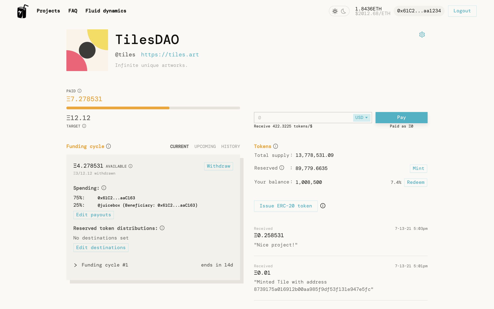
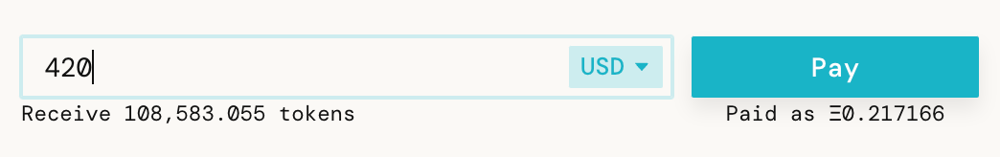
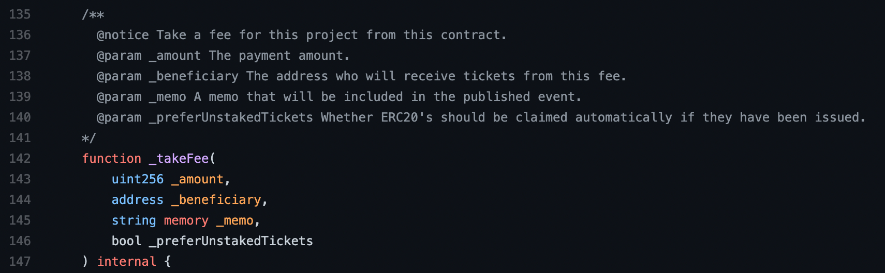
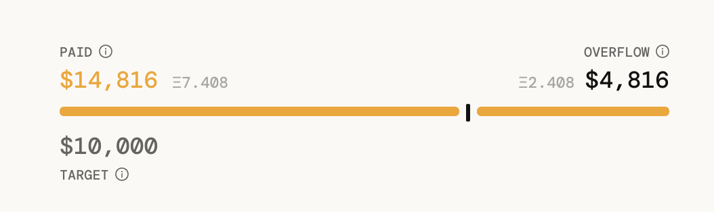
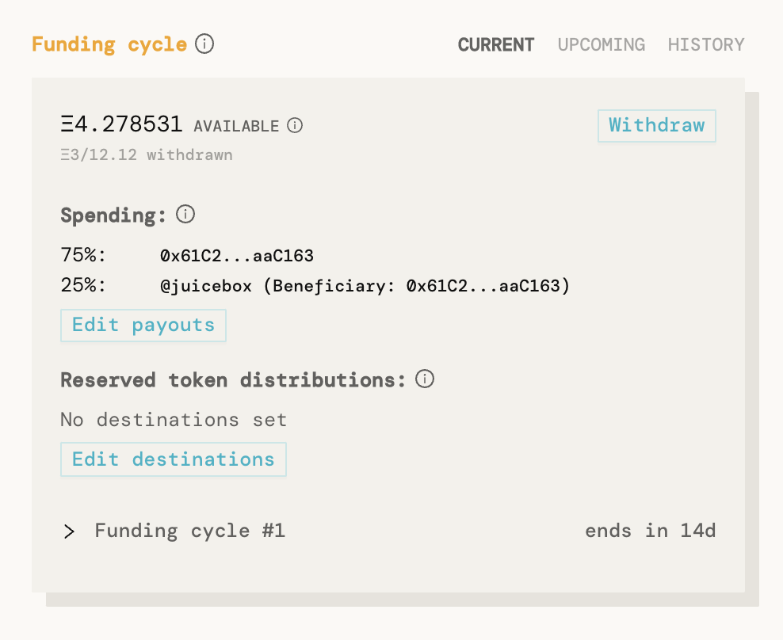

*The first of a series of blog posts explaining the Juicebox protocol, and the game plan for the first several months.*

---

**TLDR:** The Juicebox protocol's contracts have been deployed to Ethereum's mainnet, and [@peripheralist](https://twitter.com/peripheralist) has published a very slick site to interact with them.

Juicebox is a business-model-as-a-service and programmable treasury for community-owned Ethereum projects.

Go check it out at [juicebox.money](http://juicebox.money). You can begin using Juicebox as your project's payment terminal with one gas-efficient transaction.
A project running on Juicebox.
### Motivation

Long story short: indie artists and devs, DAOs, and public goods more generally, need a groovy way to capture the value they create, make reliable cashflow money out of it, and then share it back into the world. 

The Juicebox protocol does this by allowing projects to make commitments about how its cashflow will be distributed *before *ever receiving payments, signaling to users how their money will be spent ahead of time*. *It works really well as a payment terminal and programmable treasury for projects that have mostly predictable costs (like staff payouts, service subscriptions, donations, budgeted initiatives, etc.), and who want to automatically reward their community as they become successful.

### How it works

With just one gas-efficient transaction, you can start funding and growing a Juicebox project, and configuring its treasury's payouts.

Once deployed, anyone can fund your project either as a patron by making a payment directly through [juicebox.money](http://juicebox.money), or by using other contracts that take fees composably into the Juicebox protocol. Either way, they'll receive your project's community tokens in return.
People can pay you directly via an interface like [juicebox.money](http://juicebox.money).Or, inherit from `JuiceboxProject.sol` and use `_takeFee` to get paid contractually.
As the project owner, you can set a funding target that specifies how much it'll cost to create and operate your project for a set amount of time. You do this *before* anyone sends you money. If your project earns more than its funding target in a set period of time, the overflow can be redeemed by your supporters alongside you in exchange for burning tokens. This effectively pushes everyone's price to pay for your project towards zero as usage grows.

If left unclaimed, overflow serves as a runway for projects.

A project's team and its community are thus incentivized to work together to make sure overflow growth outpaces spending.

Funding cycles roll over automatically, allowing people and contracts to affordably fund projects that are important to them on an ongoing basis.

You can configure a discount rate to incentivize earlier adopters, a bonding curve rate to incentive commitment from community members, and a reserved rate to receive some of your own tokens each time someone pays you and receives tokens themselves.

Project owners can re-asses their funding needs and cycle configuration over time, and can choose to take their token holders' perspectives into account while publishing these sorts of changes to Juicebox.

---

There are several ways to configure your Juicebox projects. Here are few cool things you can do:

1. You can route your income stream through the Juicebox contracts.

For example, you can make a version of Uniswap that explicitly only needs **$X** per month to be sustainably run (labor, ops), where each swap transaction incurs a fee **($Y)** that goes towards sustaining the service. If there are enough swaps that month **(N)** such that **N * $Y > $X**, then for each subsequent swap, all accounts that have swapped (and therefor paid fees) receive a dividend from the overflowed revenue that is proportional to the amount they've contributed to the project's sustainability thus far. So if **N * $Y** grows unjustifiably faster than **$X** — which is the underlying market rent-seeking inefficiency that Juicebox projects try to out-compete — then instead of compounded shareholder wealth aggregation, everyone's price tends towards zero.

Meaning people get a nearly-free, community-driven product with no ads, guaranteed data integrity, full business operation accountability, and an open source code base that runs reliably. All built by motivated punks that are getting paid what they ask for and are rewarded alongside the community as overflow grows.
2. It's easy to program financial dependencies, so your Juicebox project's funding target can be contractually hooked up to those of people and projects it depends on.
3. You can run a recurring/one-time fundraising campaign and return extra funds to your community, or to other causes.
4. As the project owner, you can earn some of your own tokens with every payment you receives. You'll "unlock" these tokens at the rate with which your overflow grows, not according to some arbitrary multi-year vesting schedule. These reserved tokens can then be contractually distributed to staff, or to other causes.

---

There's nothing more exciting than working on/with/for the Ethereum ecosystem these days – new artful minds are being welcomed into cryptowallet-life everyday, and brilliant experiments are being crafted on the regular. It's a creator's dream – there's no need to manage infrastructure,  growth is driven by your community, and financial expectations can be anchored down by code. The Juicebox protocol was created as a means to further this end. 

If you have questions or want to contribute, don't hesitate to [hop into the Discord](https://discord.gg/6jXrJSyDFf).
