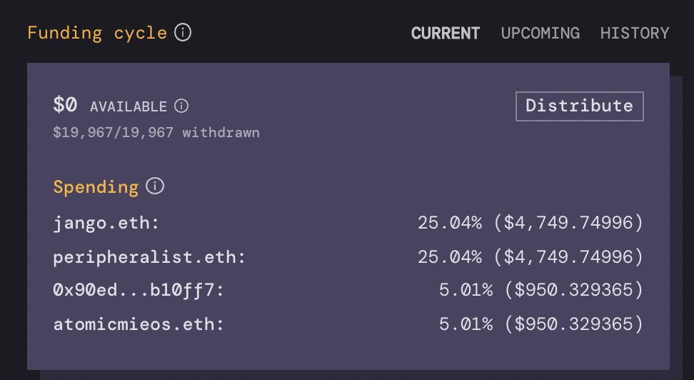

The first Juicebox configuration for the JuiceboxDAO lasts 30 days, and includes preprogrammed payouts. They are as follows: 

### Staff

- **Jango** gets **$5k** for managing contracts and leading dev and design efforts.
- **Peripheralist** gets **$5k** for leading front-end dev work and evolving Juicebox to suit needs being uncovered at TileDAO.
- **AtomicMieos** gets **$1k** for experimenting with content, and helping shape ideas.
- **Sage** gets **$1**k for design and illustration work.

### Ops 

(These funds all get paid-out to the JuiceboxDAO governance to be allocated)

- **$6.8K** to pay back Jango for pre-purchasing juicebox.eth, jbx.eth, and jbox.eth. These ENS names will be transferred to JuiceboxDAOs governance. 
- **$1k** will be allocated for content / art supplies, managed by Futurenate and Sage. 
- Figma costs **$75** monthly.
- Infura costs **$50** monthly.
- Gitbook costs **$32** monthly.
- Fleek costs **$10** monthly.

The total is **$19,967**.

The staff payout sums are small compared to market rates for these skills. We decided to start off with a small budget during the first funding cycle to encourage a longer runway, and to be able to re-evaluate needs as the first funding cycle plays out. 

Stay tuned for a report on the first funding cycle's spending, and a proposal for the next funding cycle's payouts.
