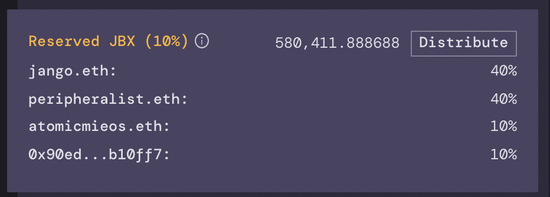

The first JuiceboxDAO configuration includes a preprogrammed reserved JBX rate of 10%, with distributions to predetermined recipients.

A new supply of JBX is minted each time the project receives a contribution. This JBX goes to a beneficiary address specified by the contributor (usually themselves), with the exception of the reserved tokens. A 10% reserved rate means 10% of these newly minted tokens will be distributable to preprogrammed recipients.

As a result, the configured recipients "vest" their JBX at the rate of the project's growth instead of a cliff/lock schedule.
Screenshot from https://juicebox.money/#/p/juicebox
### Investors

- **Jango** gets **40%** of reserved tokens for architecting the mechanism, writing the contracts, thoroughly testing the ecosystem, leading design and development efforts post-launch, and leading project relations.
- **Peripheralist** gets **40%** for architecting the front-end repo, publishing juicebox.money, and leading front-end dev work post-launch.
- **AtomicMieos** gets **10%** for experimenting with content, and helping shape ideas pre-launch and post-launch.
- **Sage** gets **10%** for design and illustration work pre-launch and post-launch.

These numbers are all a bit arbitrary. We decided to start off fairly small and fairly even – it was unclear how the risk profile of pre-launch dev work would compare to post-launch growth and refinement work, and how the Juicebox incentives mechanisms would play out in the wild. As the first funding cycle unfolds, expect a proposed reevaluation of these numbers to better account for risk dynamics and incentives.
