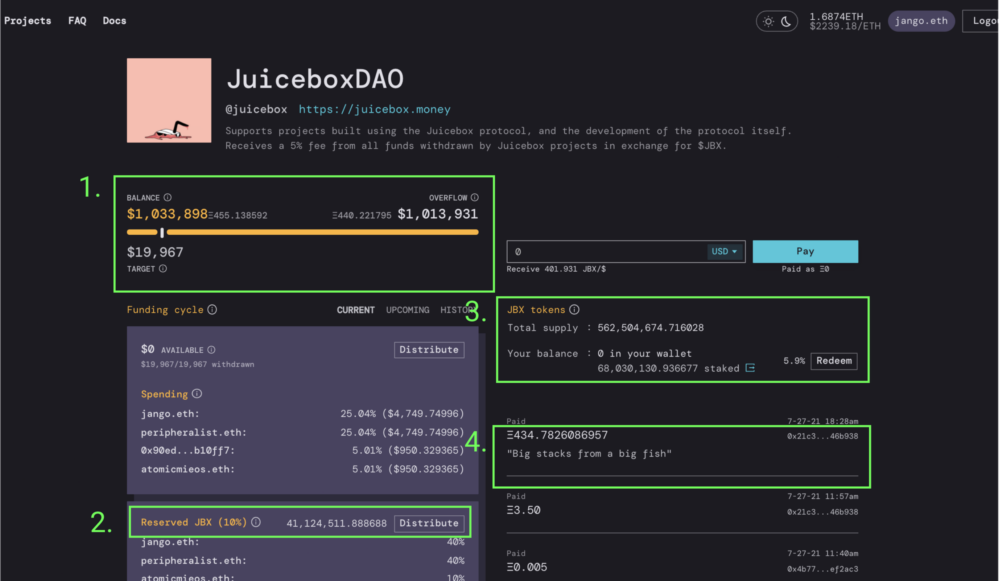

A question was posed in the [Juicebox Discord server](https://discord.gg/2K5Cs7e76K) earlier today from [@jessewldn](https://twitter.com/jessewldn):

> I’m curious if you’ve thought about if/how Juicebox projects might intersect with VC financing where there’s a large amount of “permanent” runway parked in one go that can’t be recalled. Do you think that’s just overflow, or is there a way to fine tune things to accommodate a project that wants to raise from a fluid/liquid community and from longer term investors simultaneously?

**TLDR answer:** just stick money in the protocol for the specific project. The system works the same for everyone. 

This question deserves a more colorful answer though.*
*
*Everything that follows is theory. I'd love to experiment with these ideas in practice, tuning parameters over time until we strike the right balance for both the big fish involved, the apes, the punks, the creators, the devs, and every other Etherean.*

*Also must note that Juicebox is experimental software. I did everything I could to thoroughly blast the protocol with tests, including regular, edge case, and randomized conditions. Formally however, it's still unaudited. Put money in the contracts at your own risk.*

---

## Primer

The Juicebox protocol is meant to support small projects with big ambitions, alongside large projects that want to involve their day-to-day users/community in its growth efforts and outcomes. Meanwhile, it's meant to give patrons and investors of various risk profiles confidence over their spending and their financial positions. 

A project is able to evolve by tuning its funding cycle configurations over time to calibrate incentives and investments. Specifically, a project has a `funding target`, `funding cycle duration`, a `reserved rate`, a `bonding curve rate`, and a `discount rate` at its disposal. Changes to these are made over time with the approval of a ballot contract that can be implemented with whatever governance/representation structure a project and its community want.

The `funding target` determines how much money a project can withdraw during each funding cycle, the length of which is determined by its `funding cycle duration`. 

Each payment made to a project mints and distributes the project's tokens for the payer, and allocates a reserved percentage (`reserved rate`) of tokens for a set of addresses preprogrammed by the project owner. The total amount of tokens that get minted as a result of a payment is influenced by its configured `discount rate`s over time, which incentivizes earlier contributors who naturally are assuming more a bit more risk. All funds that are received by a project that exceed its `funding target` are considered overflow. This overflow serves both as the project's runway and its community's treasury. Each token holder has an option over this overflow that they can exercise by redeeming (burning) their tokens. 

The project can configure a `bonding curve rate` that affects how much overflow each token can claim – a rate of 100% allows X% of tokens to be redeemable for X% of overflow, whereas one of 50% allows X% of tokens to be redeemable for about (0.5 * X)%, leaving the rest to share between their token hodlers.

Lastly, a project can mint a supply of premined tokens if it hasn't yet configured a funding cycle or received a payment. 

Look through [juicebox.money](https://juicebox.money), [visual technical docs](https://www.figma.com/file/dHsQ7Bt3ryXbZ2sRBAfBq5/Fluid-Dynamics?node-id=0%3A1), and other blog posts for a more in depth primer of these controls 🎛.

## Scenarios

Back to the original question: how might big money involve themselves in Juicebox projects?

The answer is to just stick money in the protocol for the specific project. The system works the same for everyone. 

Let's play out an example to see what might happen if someone wanted to dump an investment into the [JuiceboxDAO](https://juicebox.money/#/p/juicebox).
JuiceboxDAO from Jango's perspective at the time of this writing
Let's say someone parks $1 million here. My screen would then look more like this.
JuiceboxDAO from Jango's perspective after a $1 million (~434 ETH) payment.
Here's what changed:

1. There is more overflow.
2. More tokens got minted, 10% of which were allocated for distribution to the reserved token recipients.
3. The newly minted tokens were added to the total supply, which decreased my JBX ownership percent from 42% to 5.9%. 
Not pictured: the payer now owns 71% of JBX supply.
4. The payment would feature on the activity feed.

Facts about this new state we would find ourselves in:

- The project's treasury now has more money to work with, which can represent a longer runway (more time) or an opportunity for larger and more diverse payouts/investments (more impact).
- With a bonding curve of 60%, the payer could redeem their 71% of tickets right away for about $644,000 (280 ETH). This amount would increase as payments are made to the project at different discount rates over time, or if other holders decide to redeem their tickets ahead of the payer. However, this amount will decrease if the project burns through funding cycles at a faster rate than overflow grows. 
[Heres a tool](https://www.desmos.com/calculator/sp9ru6zbpk) to model the Juicebox bonding curve. `o` is the current amount of overflow, `s` is the currently total supply of tokens, and `r` is the bonding curve. The `x-axis` is the amount of tokens being redeemed, and the `y-axis` is the amount of overflow that can be claimed by redeeming the `x-axis` amount.
- The payer has an outsized majority of tokens (71%). If JuiceboxDAO uses a funding cycle ballot that is decided with a simple majority and relies only on JBX ownership for representation, the decision will hinge on the point-of-view of the payer. Ballots can be designed to avoid this, but it also kind of makes sense that any revised configurations that might allocate the $1 million would have to be approved by the person who contributed the $1 million. 

## Strategy

If you're a whale, I think you want to bet on the Juicebox ecosystem as a whole more-so than any one particular project. Everything will have more value if several promising ideas are turning into funded project's playing within the Juicebox configuration design space to grow their communities.

A project can configure Juicebox is many ways. A project with a 0% discount rate, 10% bonding curve, a 10% reserved rate, and a 50 ETH funding target proposes a very different game from a project with a 20% discount rate, 100% bonding curve, 50% reserved rate, and 10 ETH funding target. Lots of interesting configurations are possible within these gradients, and there's no way for a project to know what the best one will be ahead of time. There's hardly any precedent or data to make decisions from yet, so each project/community gets to experiment and find something that is efficient for its needs. 

As an investor, this is grounds for high risk experimentation. If you think a project is promising and want to give it $1 million, you should probably:

- be aware of its configured reserved rate. 
- get a feel for the project's discount rate and how it has changed since the project's launch. This will help inform you of how your token balance will compare to the total token supply.
- understand the project's bonding curve rate to get a feel for how liquid your position will be. 
- know how the project has configured its funding cycle ballot, which determines who holds the power to enact new funding cycle configurations (rug pulls totally possible). 

All of this is also true for apes 🦧, but they probably put money in before reading this.

Punks 👾 get to build culture and communities on top of a transparent web of interdependent people and projects getting paid what they are able to ask for.

Creators 🎨 and devs ⌨️ get to work on the projects they like, or instead launch their own. They get paid what they are able to ask for from their communities.

Every Etherean 🇪🇹 essentially gets paid as they transact through web3 protocols and (unintentionally) contribute to the growth of that protocol's project's community's treasury at that particular point in time.

## Closing thoughts

If someone contributed a fat stash into the JuiceboxDAO treasury right now and we were to expand the monthly target to accommodate more spending, I can think of many many things for us to allocate funds toward. For one, we could pay someone to help us write searchable, understandable, and inviting technical docs. We could also pay someone to help us write docs. I think we should even consider paying someone a respectable payout to come onboard to write docs.
