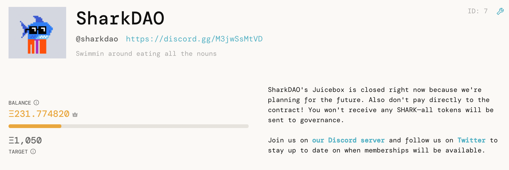
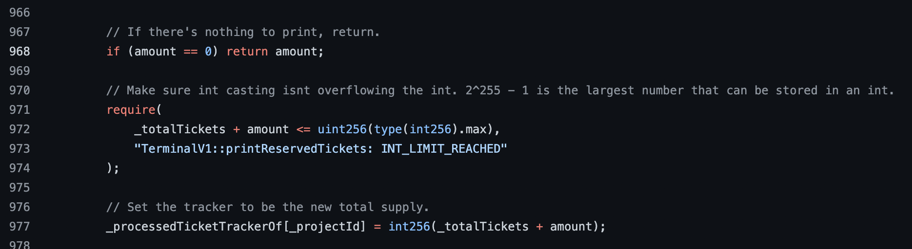
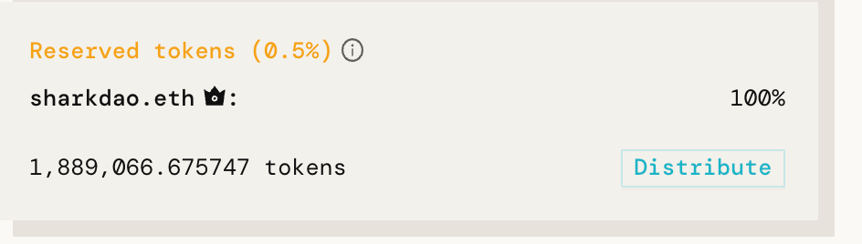
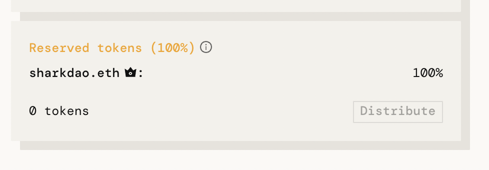

I discovered a low severity bug in the Juicebox protocol last night that affects projects that have received payments while configured with a reserved rate of 0% who later reconfigure the reserved rate to anything greater than 0%.

A temporary work around has been identified, and a game plan for removing the bug from the system is in the works.

To mitigate potential exploits before a patch is issued, an exploit breakout team decided to mint 0.5% of total SHARK supply (1,889,066.675747 SHARK) into the multi-sig wallet. This course of action was chosen to prevent further issues. These tokens can be burned if desired.

What follows is how I discovered the bug, the technical details about it, and what our next steps will be.

**TLDR:****Until further notice, projects are not advised to set their reserved rate to 0% if they intend to raise their reserved rate in the near future.**

---

## Context

To give them time to plan for for what's next, SharkDAO needed a way to pause payments and new members coming in through Juicebox. Juicebox doesn't support a `pause` function in its [TerminalV1](https://etherscan.io/address/0xd569D3CCE55b71a8a3f3C418c329A66e5f714431) contract, so Peripheralist and I had to improvise alongside the SharkDAO community.

First step was to remove the payment form from the UI. This keeps most people from sending in contributions, but someone dedicated to sending a payment would eventually find that the Juicebox contract could still be interacted with directly through other interfaces like Etherscan.

To even the playing field, I had the idea to raise SharkDAO's reserved rate to 100%, meaning all payments coming in through the contract would allocate 100% of minted SHARK tokens to preprogrammed addresses instead of to the paying address. With no SHARK incentive for contributing payments, the community would be disincentivized to pay through back-door means, effectively creating the desired `pause` functionality. If anyone did send payments, we could easily refund them the money.

After running this plan by SharkDAO at a Sharktank town hall meeting, we decided to move forward with it. We would allocate any SHARK minted during this paused period to the multi-sig, which could later be burned if needed.

A few details to note: 

- SharkDAO's reserved rate has been set to 0% since its start. 
- SharkDAO does not use funding cycles with preset durations, meaning changes can be executed on-demand. 
- SharkDAO's Juicebox project is owned by a Gnosis multi-sig requiring 3/5 signatures. I'm one of the signatories.

Right after the call, I got together with multi-sig holders to execute the plan. After one transaction to TerminalV1's `configure` function, the reserved rate was successfully updated. I immediately checked the UI to see if things were in order – thats when I noticed that after having set the reserved rate to 100%, it was now possible to mint and distribute 100% of the current token supply to the preconfigured destination (the multi-sig). Since this distribute transaction is public, anyone who triggered this would effectively double the SHARK supply, and would leave us with unnecessary work after the fact to burn this unintended supply from the multi-sig and communicate the issue to the community.

I immediately instructed the multi-sig panel to send another `configure` transaction to TerminalV1 to change the reserved rate back to 0%, and explained that I had to double check something before we could move forward with the plan. This reverted us to the previous state, where payments made to the contract directly would bypass the intended `pause` that was being communicated in the UI.

## Technical details

The root of the problem was fairly obvious to me once I noticed the distributable supply in the UI. Once we were back at a safer state, I began work to confirm my assumptions and test a workaround.

Many parts of the Juicebox mechanism's design are gas optimized, meaning the transactions that are most frequently called are responsible for fewer state changes than those that are infrequently called. The `pay` transaction is by far the most frequently called, so very few state changes take place within this function: the payment is received, and the resulting amount of treasury tokens are minted to the payer in a staked format.

Importantly, the reserved token amount is *not* minted during a payment. Instead, this amount is calculated later when the `printReservedTickets` transaction is called. It does so by taking the current token total supply and minting an appropriate amount of new tokens to the preconfigured reserved addresses such that the reserved rate is respected. Most importantly, the mechanism then keeps track of the fact that it has minted reserved tokens for the current token supply so that it doesn't create extra reserved tokens later. Given perfect information, it is in the economic best interest of the project to wait to call `printReservedTickets` if the reserved rate is going to increase, and in the community's interest to call it before an increase. The opposite is also true. This dynamic allows the protocol to offload a high-gas storage operation from a frequently called `pay` function onto less frequently called operations.

Unfortunately, when the reserved rate is 0%, the `printReservedTickets` call assumes there's no work to do, and returns before it has had a chance to update the tracker. This prevents anyone from locking in the rate before it is increased. In the [TerminalV1 file](https://github.com/jbx-protocol/juicehouse/blob/3555d7baf7fa8ba4bc350140201805c740e3df4e/packages/hardhat/contracts/TerminalV1.sol#L968), the solution is literally just putting line 968 below line 977:

Current TerminalV1 implementation of `printReservedTickets`
## Execution

I immediately proposed two workarounds to the SharkDAO admins:

- Keep the contract open.
- Set the reserved rate to the minimum possible value (0.5%), distribute the allocated reserved tokens to the multi-sig, then move the reserved rate to 100% as intended.

We decided to go with the second option since we needed to set a fair playing field to community members looking to pay, and we could later burn the relatively small amount of SHARK minted to the multi-sig.

I then spent a few hours recreating the the original bug in our integration test suite, and wrote an integration test for the proposed solution to confirm it would work as expected (I was making extra sure of everything at this point in the evening.) Once everything was confirmed on my end, I got together with the multi-sig holders to execute the three transactions:

1. Change the reserved rate to 0.5%.
2. Distribute reserved treasury tokens to the multi-sig. (Anyone can trigger this, so Xaix did it from his personal wallet.)
3. Change the reserved rate to 100%.

The side effect is that 1,889,066.675747 SHARK were minted to the multi-sig. Here's a screenshot of what the UI looked like after step 1:

And here's what it looks like now:

We got all of this done in about 2.5 hours.

## Takeaway

Despite having written extensive unit, integration, and load tests, this condition fell through the cracks. I will keep stressing to the community that Juicebox is still experimental software with high risks. I'm confident in the way it's built and am committed to its improvement, but I'm not going to pretend that it is perfect.

The good news is that TerminalV1 has a built in mechanism to allow projects to choose to migrate to new terminal contracts that have been approved by JuiceboxDAO's governance, so bugs like this can be fixed. 

We are now working around the clock to get a TerminalV1_1 safely set up for migration, and extensively tested.

**In the meantime, projects are not advised to set their reserved rate to 0% if they intend to raise their reserved rate in the near future.**

Next steps:

- Deploy TerminalV1_1 that patches this bug.
- Consider building a version of the Juicebox Terminal contract that supports pausing payments.
- Seek more code reviews and audits, while offering bug bounties to hackers who want to help.
