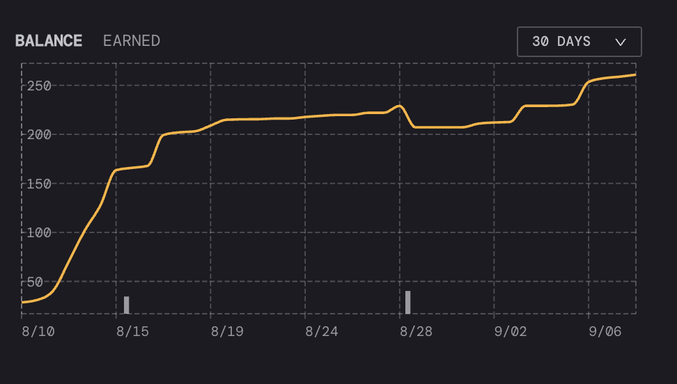
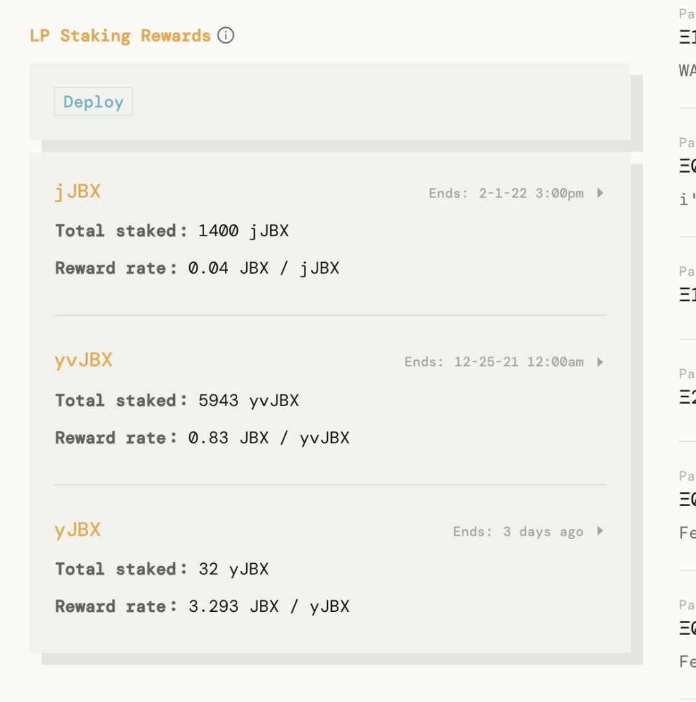

Co-authored: jango, peri, exekias, nati, nicholas, zeugh

**Current focus areas are:**

- Risk mitigation
- Web experience
- DAO relations
- Analytics
- Liquidity pools
- NFT marketplace
- Governance
- Protocol upgrades
- Materials

## Focus areas

### Risk mitigation

*Goal: Make sure things don't go to zero.*

*Current team: jango (lead), exekias, peri.*

**Updates:**

- No new bugs/problems discovered in the contracts. 
- New repo where security issues are documented [here](https://github.com/jbx-protocol/juice-security).
- Wallet connection issues in the front end solved. One remaining bug where connecting wallet from the projects page sometimes causes the `beneficiary` field of payments.
- DefiYield auditors seems to have dropped off. Need to follow up again.
- Focus on security now moved to V2. Documentation, tests, audits, etc.

**Help needed:**

- It'd be great if more folks could help write tests and review the code and documentation as it gets done. We should collaboratively mold this into its final, secure form.

### Web experience

*Goal: Improve the Juicebox experience both for people starting communities and for communities that are growing.*

*Current team: peri (lead), jango, exekias*

**Updates:**

- New analytics data in project dashboards. Still room to grow, more data sourced into The Graph and ready to use.

- New wallet connection integration. Can now connect with many other wallets with BlockNative integration.
- Progress on Github issues backlog.
- Wording in the interface being reconsidered:  "staking" vs "claiming". 
- Researching different UIs for different treasury types.

**Help wanted:**

- Backlog at [https://github.com/jbx-protocol/juice-juicehouse/issues](https://github.com/jbx-protocol/juice-juicehouse/issues)

### DAO relations

*Goal: Work towards making sure JB projects and the JB community have the resources and attention they need to get started and thrive.*

*Current team: nati (lead), jango, nicholas, mieos, zeugh*

**Updates:**

- Gitbook updates underway. Walkthrough, explanation of processes. 
- Working with Whiteboard crypto, UltraDao, BeatsDao.
- Focusing on established DAOs. Might refocus to newer DAOs later.
- People should forward questions from #support and from other JB projects to Nati to aggregate into docs.

### Analytics

*Goal: Give projects rich insights into their community treasury.*

*Current team: peri (lead), buradorii*

**Updates:**

- Most updated in the UI under the "Web experience" focus.
- Experimenting with what data can be accessible in the UI.
- No updates on Flipside or Dune analytics.
- People want to see current token holders for each projects.
- People want to see current FC vs upcoming FC.
- People want to see the price the treasury token is being sold at over time.
- People want to see the percent of the tokens that they will own at the time of making payments.
- People want to be able to play out funding cycle scenarios before making reconfigurations.

**Open to help:**

- Index more Subgraph events.
- Display discount rates (tokens/ETH) of past funding cycles.

### Liquidity pools

*Goal: Add support for JB treasury tokens in secondary markets for communities to be able to value their assets better.*

*Current team: exekias (lead), jango*

Updates:

- Experimenting with Synthetix [staking rewards contracts](https://github.com/Synthetixio/synthetix/blob/develop/contracts/StakingRewards.sol): [https://github.com/jbx-protocol/staking-rewards](https://github.com/jbx-protocol/staking-rewards).
- Fleshing out UI prototypes:

**Help wanted:**

- Comms with JBX project owners (e.g., SHARK) to understand their needs from a staking reward/LP perspective.
- Devs with staking rewards expertise.

### NFT Marketplace

*Goal: Give JB projects a place to sell digital (and eventually physical) goods which pipe percentages of revenue to any number of addresses or Juicebox treasuries.*

*Current team: nicholas (lead), jango, peri*

**Updates:**

- Big demand from SharkDAO (and others?).
- Draft of contract looking good.
- Plan for V1 is no UI on juicebox.money, make bare bones JS SDK/library with/for Shark to build a NFT MKT into their forthcoming website. 
- Need to finalize what will be included in v1, and what won't.
- [Specification draft](https://hackmd.io/QIzjphTdQjKpb-JYOS_Viw)
- [Github repo](https://github.com/jbx-protocol/juice-NFTMKT) (private for now)

**Goals:**

- Finalize spec for v1
- Get a working v0 implementation on Rinkeby by Monday 2021-09-13 EOD
- Get a basic 721 contract together to mint NFTs that we can submit to the marketplace

**Help needed:**

- Jango will help with contract implementation and testing (thank you –nicholas)
- Next week open to help starting building a JS SDK

### Governance

*Goal: Plan out how we will make decisions together.*

*Current team: zheug (lead), unicornio, 9birdy9*

**Updates:**

- Trying coordinape to test a reputation system. The epoch system feels good, didn't give us the easy integration to voting that we needed after the epoch. 
- We're still wroking on our basic model for how to make decisions. Need to balance governance power between token holders and reputation/contributions but we haven't got a way to test it yet.
- We can, at the moment, take the csv of reputation distributed after the Epoch, but are still looking on how to import those in a strategy to snapshot.
Need help from more dev oriented folks to communicate coordinape results onto snapshot.

**Help needed:**

- We need some dev/snapshot help to integrate our new governance system into a snapshot strategy.

### Protocol upgrades

*Goal: Evolve the protocol to be more useful.*

C*urrent team: jango (lead), peri, exekias, nicholas*

**Updates:**

- V2 has been announced [here](../juicebox-v2/).
- Reviewed V2 with Peri, Exekias, and Nicholas, got very valuable feedback that is being iterated on.
- Docs for V2 are in progress [here](https://docs.juicebox.money/overview).

**Help needed:**

- Same as in the "Risk mitigation" section.

### Materials

*Goal: Vi*deos/visuals/memes/stuff that radiates Juicebox vibes.

C*urrent team: WAGMI studios*

*This is a new section that will have updates next time*
