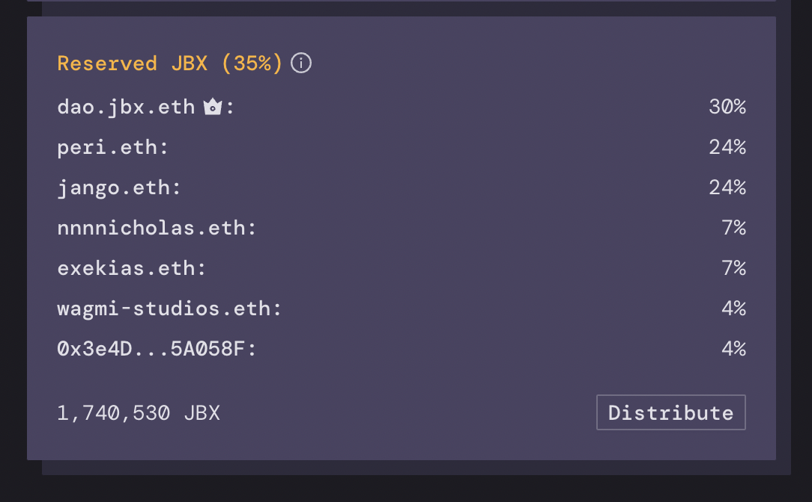

As funds are contributed to the JuiceboxDAO treasury – either as direct payments or as fees paid – JBX is minted and distributed. Currently, 35% of these are reserved and allocated to preprogrammed addresses while the remaining 65% are sent to the contributor of the payment. 

The current distribution of reserved tokens for JuiceboxDAO is as follows:

There is no cap to how many JBX are minted into existence: as more ETH is contributed, more JBX is created, albeit at a slightly decreasing rate over time due to the discount rate (currently 10% fewer JBX minted per ETH every 2 weeks). With each payment, the pie being shared grows while everyone's share of the pie slightly shrinks.

... except for those on the reserved tokens list. At any given moment, their overall JBX positions tend towards the percent of reserved tokens they're programmed to receive, at the rate of the treasury's growth. This also means that currently 35% of the DAO's value tends to concentrate between the reserved token holders, with the remaining 65% going to a long-tail distribution between those who chipped in or paid fees to the treasury over time, favoring those who did so soonest. 

JuiceboxDAO's reserved tokens have thus far been mostly allocated to those few contributors shouldering operational responsibilities to the DAO. Recently the DAO also began reserving tokens for the DAO's multi-sig in order to redistribute to LP staking rewards and other programs. 

Going forward, the DAO's greatest opportunity to coordinate incentives among its community will likely come through expanding the reserved pool to include many new members and campaigns with proven commitments to its success, as well as smaller scoped experimental distributions.

With a few basic guardrails and guidances in place such as those outlined in the [DAO's governance documents](https://juiceboxdao.notion.site/Governance-f0ff06c503914500acb9bd646cc4ed65), the DAO should be set up to fairly and efficiently welcome in meaningful contributors, while shedding those who are no longer participating or useful. This process should spread the value the DAO creates to the people actively furthering the project's mission statement, and to the projects building on the protocol who are paying fees over time.

I'm very eager to see more reserved token allocation [proposals](https://juiceboxdao.notion.site/Governance-f0ff06c503914500acb9bd646cc4ed65) over the next several months, and for the number of reserved token receivers to grow substantially.

### Aside

The reserved rate also makes a 51% takeover very expensive. JuiceboxDAO currently has a total supply of 577,516,558 JBX tokens. Each ETH contributed mints another 544,320 JBX (353,808 to the payer, 190,512 to the reserved pool). In order for someone to mint 51% of tokens for themselves today, they would have to dump 3,865 ETH into the treasury. This will just get more expensive as time goes on since the total supply will increase over time as the number of tokens minted per ETH contributed decreases.
