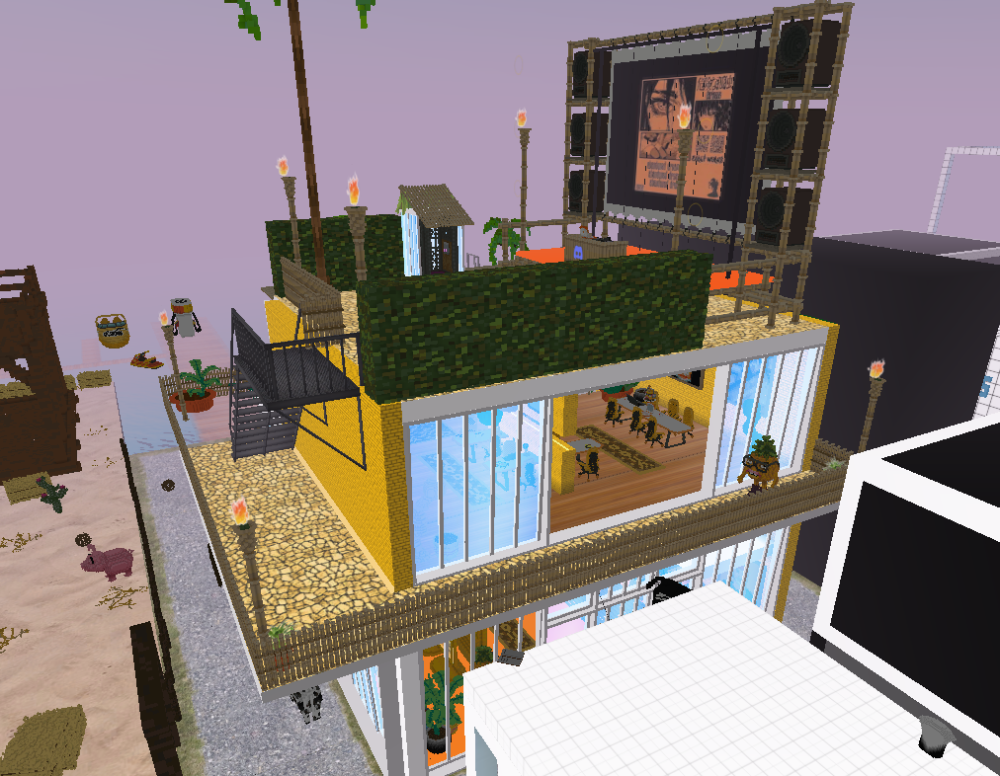
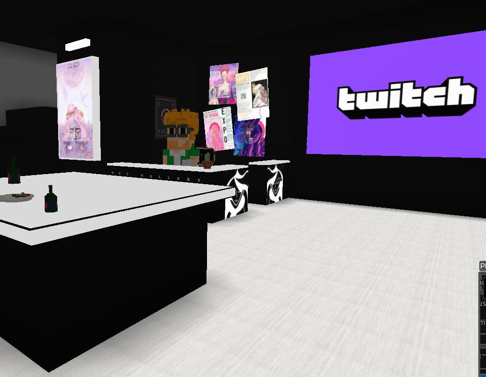
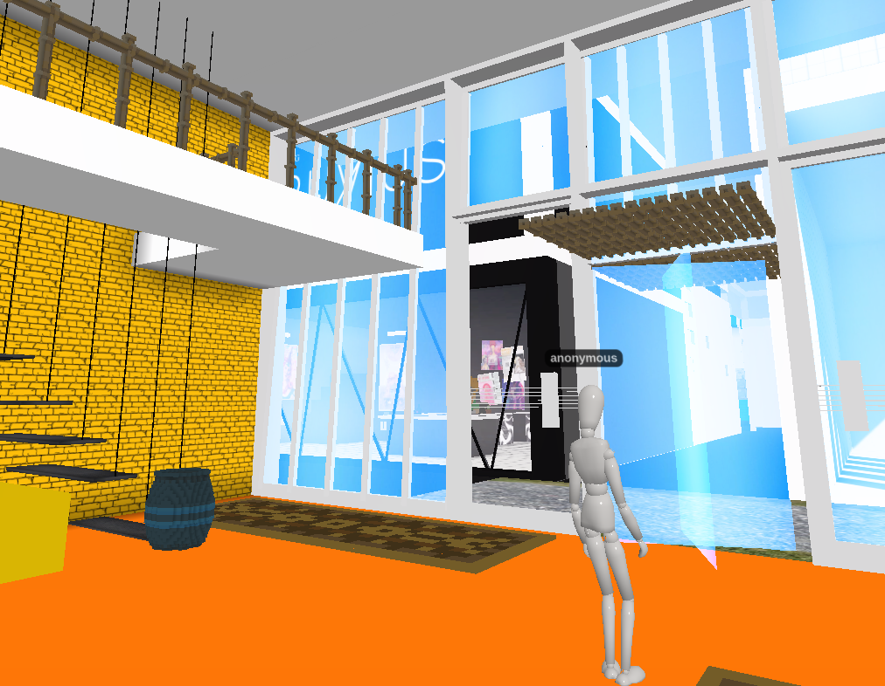

The Cryptovoxels environment from above
## A new way to wind down

The DAO space online isn’t like your average experience working at a company or corporation. Unlike the physical environment of offices, cubicles, and maybe the occasional beanbag chair if you happen to work at one of those *fun* places, the online space where DAOs operate is free from constraints and incentives. It’s a space where people create for the sake of it, and pool effort together as a means of expression. Don’t get me wrong, there are plenty of endeavors out there that seek to make money, but the crucial difference is about what we call the bottom line, and what it looks like in a DAO space versus traditional settings.

Enter Cryptovoxels: an online space where participants can congregate, listen to music together, and even enjoy a “live” show in a virtual environment (pictured above). The Cryptovoxels space isn’t unique for what it is— plenty of paid spaces exist that try to achieve the same goal. The reason Cryptovoxels is unique is precisely for what it isn’t. It’s not about raising money, or pandering to users for shares and likes and what have you. It’s a space to wind down and enjoy together in a uniquely anti-consumerist experience. A space where creatives, programmers, technical writers, holders and any and all between can congregate for the sake of it.
A lounge in the Cryptovoxels space
## Creating for the sake of it

Spaces like Cryptovoxels are unique because of how they come about. In a traditional work environment or major corporation, somebody at the top may have an idea to create a space such as Cryptovoxels. From there, the idea would distill as it trickled down the workforce, ultimately culminating in strict directives and program managers. In other words, the project would itself become work— anathema to its very purpose!

In the DAOsphere, the whole process is put on its head. Eager community members, excited to contribute to a greater organization, and at times simply wanting to spin their wheels, generate projects such as Cryptovoxels not in order to make money, not in order to boast, not in order to monetize an experience, but, rather, simply to enjoy a moment— a happening, a vibe— with one another in a shared space. Where else can we say that this is the case?
A Cryptovoxel room, replete with revolving door and anonymous puppet avatar)
## Web 3.0 is a state of mind

The spaces engendered by an overall feeling toward collaboration, decentralization and egalitarian work-force options are encapsulated by Cryptovoxels. They’re spaces that uniquely represent a way of thinking about the world and its members differently than before. They represent an open view of the world that seeks to collaborate into greater and greater projects without, importantly, treating everything in accordance with it’s bottom-line monetary value.

The era of web 3.0 is ushering in a way of thinking inclusively and openly about collaboration unlike anything we’ve seen before. The irony that the same Web 3.0 that brought us NFTs of just about everything can also bring us closer together in a completely non-exploitative way is rich, to be sure. But seeing this irony as a beauty, rather than a contradiction, is probably a better representation of the spirit of our times.
