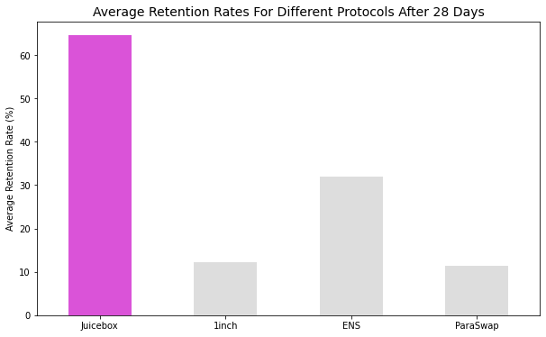
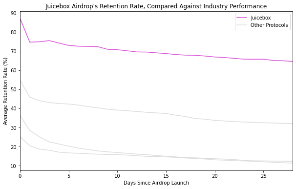
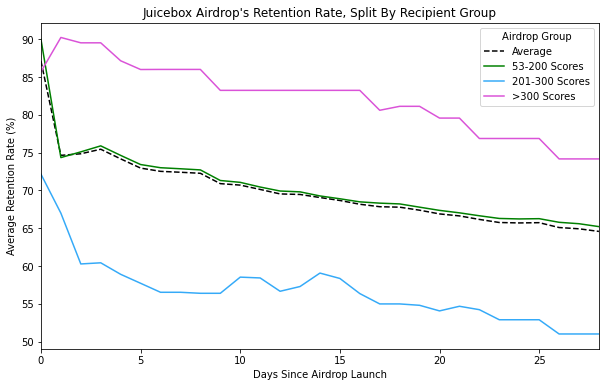
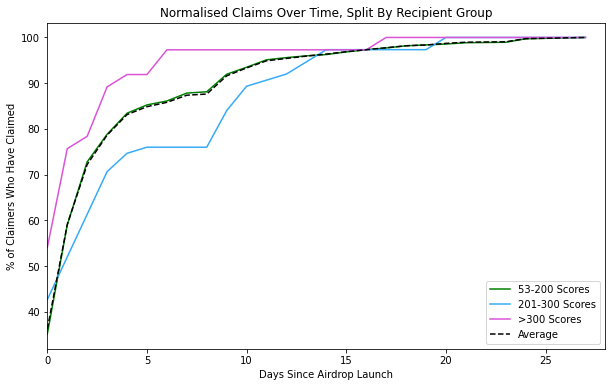

# Juicebox Benefits Program Update

*If you held JBX before 2022-02-23 and have not done so already, [claim your JBX](https://airdrop.juicebox.money/)!*

We've seen some super interesting results from the [Juicebox Benefits Airdrop](https://info.juicebox.money/blog/juicebox-benefits-program-explained) which launched last month. [ARCx](https://arcx.money/) has worked with us to collate and summarise some preliminary findings from the airdrop. Results below!

## Definitions

To fully comprehend the findings, it helps to quickly define the terminology used in our analysis.

Most of these findings centralise around a concept called the "Retention Rate". The retention rate is defined as the **lowest JBX balance for an address after the airdrop**. To better understand this, let's use an example:

`0x123` claims 100 JBX tokens from the airdrop. They then go on to sell 30 of their tokens immediately after claiming. This address then waits a week, and buys back the originally sold 30 tokens. In this scenario `0x123` would have a retention rate of 70%, even after buying back the tokens, as it is the greatest amount of tokens sold after the claim.

This logic ensures that per address the retention rate can only go down over time.

The second concept to understand is the "Average Retention Rate". Many of these graphs aggregate the retention rates across all claimers in the airdrop. The average retention rate is defined as **the average of all the retention rates for all addresses whom have claimed already**. So, again using an example, if 10 addresses claimed the airdrop each day, then the average retention rate on day 1 would only consider the first 10 address and not any of the addresses who claimed on day 2, day 3, etc.

## Findings

The first graph shows retention rates 28 days after several major airdrops. The Juicebox Benefits Airdrop had unprecedented levels of hodling!

The next graph also shows retention rates, but instead shows them over time. After a brief selloff, retention was remarkably stable.

Next, we consider this same retention rate over time broken down across the 3 different score chorts (see [JBP-114](https://snapshot.org/#/jbdao.eth/proposal/0xd10c56f453851063665241417642352beaf8816aca062c29f98b1f5154ff3cdd)). Interestingly, the cohort with scores between 53-200 had the second highest retention rate, beating out the 201-300 cohort by ~15% at times.

Finally, we looked at how quickly each cohort claimed their JBX. Interestingly, the 53-200 tier fared better than the 201-300 tier in this metric as well. 

Thank you to everybody who helped make this airdrop happen. More information and analysis will be coming soon!
