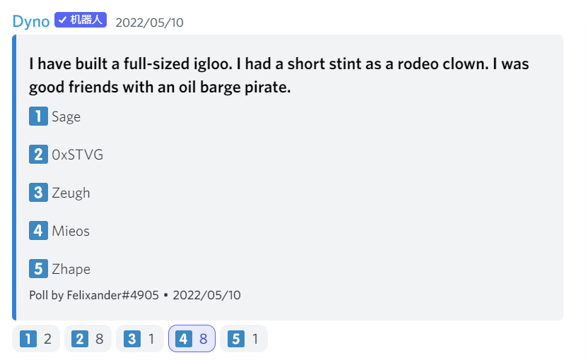

---
slug: 2022-05-11-town-hall
title: 2022-05-11 Town Hall Summary
authors: [zhape]
tags: [dao, town hall, news]
---

# JuiceboxDAO Town Hall May.11, 2022

### 1. Intro

### 2. Front end update from @aeolian:

We had another good week, and pretty much on track for a Mainnet launch in the next 3-4days. We started a feature freeze 36h ago, which means not merging anything unless it’s a critical bug, none of which is found, to allow us to merge a big PR that supports a new subgraph. New subgraph is currently indexing the mainnet, now it’s a waiting game that needs logical coordination to get things to happen. Once that’s in, we are basically ready to launch V2 on mainnet. The good thing is, that the launch is not a one-way door, if we have major issues, we can always switch back to V1 to fix the issues and switch back to V2 after that. It has been a much bigger effort than we all imagined, but it is now coming to a close here.

### 3. Quick inventory check by @jango: 

Not sure if it’s useful but I think the past few days after V2 has been up, folks have been more future and forward looking. There’s been a lot of ideas coming up that people are prototyping and playing with. Sometimes people are in tune with things happening while sometimes not. I just want to make sure that we all somewhere are aware of what’s on our mind and where different projects are at.

1) V2 contracts (deployed) : V2 contracts have been shared quite a few times in Town Hall. These have been deployed in the 4th iteration which is feeling great. So, our products are basically done in their initial capacity and in the needs of contracts. I just want to make sure it’s communicated out enough so folks know how to use it.

2) Docs (deployed, iterating): The docs are started by @filipv and a bunch of stuff has been added from a technical perspective. Those are done as well and constantly iterated on.
@filipv: I am very excited to help centralize a lot of resources to build extensions to the protocol, and it is like a repository of information about everything related to Juicebox).
@jango: Big shouts for helps in setting that up in the beginning and shouts for WAGMI studio, @sage and @mieos for starting to create a whole-worldly vibe for what a repository of higher knowledge could look like.

3) Fee extension (formalizing): This is a solution to use V2 tooling to route incoming payments to JuiceboxDAO to best yielding places for JBX, on AMM or first party issuance mechanical. It is looking great and we are wrapping up tests and playing with optimization, kind of in a formalizing stage.

4) veBanny contracts (formalizing): This is a way of staking JBX for an NFT ve position, which is locking your JBX over time to have a new kind of accounting primitive to use for governance. I hope we can align decision-making with a longer term community interest in this way. Alongside it, a lot of art is being experimented by the WAGMI team, tankbottoms and natasha. This job is also being formalized, we are trying to piece together, according to CURVE ve contracts, how we might do delegation in this scheme. It’s very promising.

5) V1→V2 migration terminal (prototyped, formalizable): Once V2 is up, projects can have a V2 token issued if they choose to operate on V2 as well as V1, which is what JuiceboxDAO will do. We are going to prototype a terminal where the V2 treasury will accept the V1 treasury token as payment and issue its V2 version one for one (1:1). It, to some extent, works within the mental model of how Juicebox treasuries are working, and we are trying to manage the migration in that way.

6) NFT market (prototyped): It is a topic that has been lingering for a while and happened in conversations quite many times and might be on the horizon. It’s a set of contracts that allow folks to list NFT with the sales routed through a particular Juicebox treasury or a set of treasuries. The goal of this project is, instead of having the pay button as the way to pay projects, anyone could upload an NFT that could basically serve as the pay button. Someone could just buy the NFT and the funds would be routed to the treasury. This is in effect a more engaging pay button that is extended to do the NFT related treasury things. This is also prototyped, and it seems we also have a few prototypes from @tankbottoms as well. It still need some design iterations.

7) V2 versioning fire drill (prototyping): There’s an idea floating around once we get V2 up to sooner rather than later organize how versioning might work on V2, like we might deploy subsequent version of the payment terminal V2, which is a feature of V2 as hyperforkability. People can roll their treasuries and migrate between terminals. Might be interesting to be right off the bat, before some happenings or pressure, to migrate from one terminal to another slightly optimized one. This is not really a big deal but more so to get the cadence of feeling confident in how we might organize files. It’s not an urgent matter, but we should think of doing it instead of waiting till things get chaotic and we’re driven by necessity to migrate, by then things tend to be more delicate.

8) 1:1 terminals for L2 strategy (pre-prototyping): The L2 strategy allows projects to manage treasuries on not just mainnet but any other L2, then to have their tokens organized across chains, taking redemption into account, etc. There is a good design for it, it just needs to be prototyped. 

9) Subscription terminal (pre-prototyping): It’s not really worth touching on but @jigglyjam brought up a cool use case that might be fun to sail for.

10) Juicebox reverse ENS registry (pre-prototyping):With the V2 tool box available, front end brought up a good point regarding Juicebox reverse ENS registry. In V1 we had handles for projects which is great in the short term, but it has a whole lot we need to think about for a long-term perspective. In V2, we just started with project IDs, so that people can build things on top of it. Front end has already accommodated ENS support for projects to use as URLs to access their treasury, but there’s couple of things in the UI that need to be nicer if there's an additional Juicebox reverse ENS registry. 

11) Treasure hunt: 
@mieos has been working on a treasure hunt on cryptovoxels.com which is pretty exciting. 
updates on treasure hunt by @wackozacco:
We are trying to experiment to coordinate something special with V2 promotion. Please go to the 3rd floor of the parcel, where there are clues for seed phrases of the treasure chest. There is already 150k JBX inside the wallet. After V2, @mieos will set up another discord to give clues for the decoder. We try to plan some more scavenger hunt type of things.

### 4. Nance bot by @jigglyjams:

Nance bot has been up and running since the last Funding Cycle, and I am working on scheduling it now. I am definitely interested in how subscription payments tied into it for future DAOs. Nance is like automating the governance pipeline, e.g. Juicebox has a notion-discord-snapshot pipeline, this feels like their valves, and also works for other Juicebox projects using similar structure. The notion page by @filipv and @jigglyjams is [here](https://www.notion.so/juicebox/Governance-Automation-Overview-772dc68367a741fe9d96f768997a28eb)

Utilizing nance bot is currently through CanuDAO, I am planning to use the subscription contract for future DAOs to pay for the use of nance bot.

@jango: I am interested in taking a step in the subscription terminal, it could be an interesting project and a decent entry in building Juicebox extensions too.

### 5. Podcast updates by @matthewbrooks and @brileigh

We have just posted the 1st podcast with @dropnerd from SharkDAO, currently we are editing the 2nd episode which was recorded with @drgorilla and @zhape about Moody’sDAO, and working on finishing that up. I think the results are good so far, and we are open to constructive feedback.
@jango: I suppose Moody’sDAO should be another project worth mentioning here. We are trying to make everyone aware of what’s happening, say it out loud the priorities, and see how to nudge each other towards bringing things over the finish line one at a time. Surely everything is making an impressive progress over the past months, some of them are really hefty projects that are not easy to spec out let alone bring it to the finish line.

### 6. Presentation by @tankbottoms and @filipv 

In general, this presentation talks about different objectives based on the foundation which is helping people confidently run programmable and community fund treasuries, from start to scale openly on Ethereum.

A lot of people are using Juicebox so far because these are short term project instances which Juicebox is amazing for. You go to the website and in a minute you can have a treasury set up with the project’s page. But a lot of projects are more oriented towards longer term development, and would want to have their own website and an interface custom suited to what they need to do. Something @aeolian brought up today is super valuable in building out different libraries of components which makes it super easy for projects like Flamingo or Muse0 to interface with the Juicebox protocol.

Part of enabling people to build longer term oriented projects is to help approach legal things in a way that makes people more confident. We can add terms of use and a privacy policy for juicebox.money and other front end. And we are also working with dao-lawfirm.eth, the one @tankbottoms is working with, to set up some accessible packages for Juicebox projects and potential templates and generic policies which will hopefully help people build on Juicebox with more legal peace of mind.

Another idea is to bring in some DEFI capability by using some of the functionalities that V2 provides and we can start by doing stablecoin, overtime we can work with different services providers to set up bot terminals which people can add as a payout and then be able to interface with different DEFI protocols. If JuiceboxDAO is focused on treasury management for DAOs with long term orientation, being able to diversify and split ETH into a bunch of stuff is probably more attractive than just keeping ETH in the treasury in terms of minimizing risk.

Another part will be genesis NFT creation. I just did the pull request for the NFT delegate. The first 100 people that contribute to your project should get an commemorative NFT or people who contribute more can get the NFT. The delegate is a new function or a feature in V2 that executes an arbitrary smart contract or basically does whatever you want whenever someone pays or redeems with a Juicebox treasury. 

Q: When this stuff is implemented, how much longer is it to launch a project? Are you going to have the option to not use these things by bypassing them, like, if i don’t want them but just something simple, can I click a button to bypass?

@filipv: I wonder if it makes sense to implement these things as an optional library or even on a separate website from the main juicebox.money interface. If you want to do NFT, you can go to the other website.

There are a ton of functionalities tank has been working on. Like this NFT market is to some extent extending the functionality of minting NFT which projects can use, and contributions on the market place can be sent to the DAO treasury. 

The bot terminal basically creates treasuries which will interface with different DEFI protocols and we can create custom strategies to diversify assets and to manage treasury as easy as adding another payout. What’s great is that there is no fee in between projects in V2. The idea is to make it sticky and make people want to build in Juicebox because it’ll give them access to these tools such as NFT and DEFI stuff like that. First these are built for JuiceboxDAO, but eventually hopefully will be accessible to the entire ecosystem.

@jango: We should continue to go out and prioritize and try to refactor until the right way  to present it to folks, in a way that preserves the users’ focus as they are trying to find out how to set up projects and achieve certain things. I am curious how you see a lot of these new features playing in one place because a lot of mocks belong to juicebox.money or navigatable from the same UI. Maybe this is a question that we should keep in mind as a group going forward. There are going to be some competing for space in the interface, or competing for attention. 

@filipv: In my opinion, one super valuable work flow would be to compartmentalize all of these into APPs. we can build this library of extensions in the Juicebox protocol. If you want to use it for your project, you can click “add”, and people can put in their custom contract. 

### 7.  On Gorilla Marketing: 

@filipv: I want to mention the Gorilla marketing that @Zeugh is up to. There’s a lot of discussion of physical presence at conferences. I think it has a lot of potential. Anyone interested can reach out to us.

@Zeugh: That’s something I am excited for. I’ve been talking a little more this week with @felixander and @casstoshi about joining some forces to make it better by integrating gorilla marketing, pulp writing and search optimization. I believe we are going to have some nice news soon on getting better visibility. I was reading about treasure management, talked with @twodam, @jango and @drgorilla about the runway we have in ETH. And one of the solutions I believe is to get more projects inside and make that treasury grow. So ETH goes down, treasury goes up. It makes a whole lot of sense to me that marketing, writing and visibility can play a good part in that.

### 8. On user flow. 

@filipv: Does anybody have any thoughts on user flow, and what that would look like as these extensions are built out?

@jango: I am gonna say these are gonna come together over several weeks. This will continue to be a topic in subsequent town halls. We will keep revisiting.

@nicholas: I think maybe it’s interesting to think the creation flow could be people coming from very different points of view. We may be having an easier time building a treasury set up for their use cases. Then maybe those are rolled into this modular interface content. 

### 9. Quizz time:   

The answer is……..@mieos
