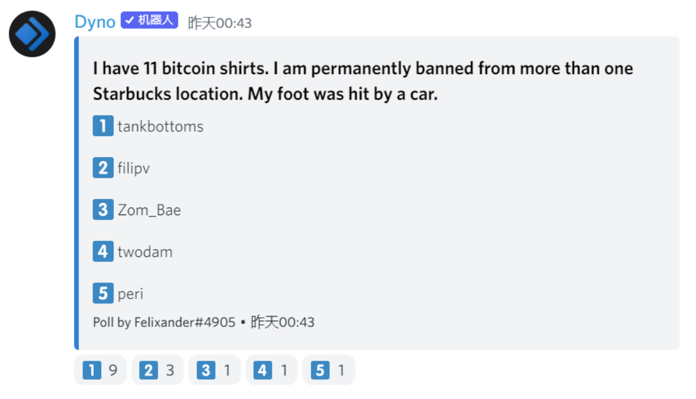

---
slug: 2022-05-17-town-hall
title: 2022-05-17 Town Hall Summary
authors: [zhape]
tags: [dao, town hall, news]
---

# JuiceboxDAO Town Hall May.17, 2022

## 1.Product prioritization discussion @jango:
**@jango:** 

We are to some extent acknowledging the moment we find ourselves in from a product perspective, specifically juicebox.money essentially. We just got to the V2 milestone which is massive and there is natural inclination to add to what’s next. We have a bunch of projects in flight, as we discussed in last Town Hall.

There’s a lot of work going on and a lot of them are closing the finish line. They are probably not going to be in production at the same time, so we’ve got to figure out what our priority is and the way we think about prioritization going forward. Maybe we could just say we’ll do it next week once we get it more put-together, although it is solid as it is.

**@aeolian:** 

I think we can refine it a little bit. By next week, we probably will have a more solid plan before we actually gonna build. Yeah, we can leave it until next week.

**@jango:** 

I think the main thing is that there’s a lot of fun, powerful, shiny things in a lot of people’s work, which is about to have the possibility to come into fruition. For the time being, it’s quite clear what the priority is, that’s risk mitigation and making sure these small bugs that naturally have found themselves in a little bit to the product via this long stretch. There’s a couple of blaringly obvious pieces that the V2 has. 

So in the short term, maybe a week or a few weeks, it’s really coming to terms with what those are and making those as clear as possible in the UI and then giving us an avenue to peel those back as we have known extensions, because almost all of the stuff is extension related. We can create the system to disclose one at a time appropriately. And it’s not a big shiny future but it’s pretty important. I think top priority with these things is to keep things from going to zero, kind of our job. 

The 2nd priority is currently straight in the dark to increase the number of projects and the volume of payments. The good news is there is plenty of work we can do right now to stitch up the risk stuff and the bug stuff as we deliberate strategy. But as that gets wrapped up, then we’ll want to all be on the same page about what we're trying to deliver next together.

**@aeolian:** 

I think it’s worth calling attention to the fact that it’s quite amazing Juicebox gets where it is. We should all have confidence at least from the UI perspective. When projects come along that kinda have the fire power, it’s able to really facilitate the payments. So it’s like, do we take this to the next level? What’s the next level? That’s really the point of the strategy channel and that document([here](https://www.notion.so/juicebox/juicebox-money-direction-b9bdac96c0f446a492ee76dee4faa4cf))and these discussions.

## 2.Brief explanation about JBX delegation by @filipv: 
We now have delegation on snapshot, so if you go to [this link](https://vote.juicebox.money/#/delegate/jbdao.eth), you can delegate your JBX to other addresses for the snapshot voting. Tks for the amazing help from @drgorilla btw. Let’s say you have 1m JBX and you’re delegating to someone with 3m JBX, when they vote, they're gonna have 4m JBX. But then if you vote after they voted, their vote will go down to their original 3m JBX, which means you still can vote on any proposal you want and they will lose your delegation, specifically on that vote. Right now this is working with both claimed and unclaimed JBX and then we’ll be moving over to the veBanny when it happens.

## 3.Work report by @twodam on new dashboards and protocol research:
There is a new Dune dashboard made by twodam in [this link](https://dune.com/twodam/Juicebox-Gas-and-Fun-Facts), in which you can find gas fee specification about setting up and managing a project in the protocol, as well as some fun facts such as “projects created per address”, or “ how many has an ENS” and so on. And he is going to do some Protocol research and comparison, current list: Mirror Parcel Superfluid Coordinape Utopia Aragon

**@jango:** Just shout out for these incredibly useful analytics and there’s a lot of them. Sometimes I try to find signals in these numbers. So I appreciate the readiness to take on new requests and make dashboards for things over time. It’s damn helpful.

**@twodam:** I have made some dashboards and maybe I need to write some reports based on these data.

**@jango:** I don’t know if VJ or Goldstein have worked using these dashboards but they created reports that might be based on your number, which I am actually almost certain they are. Like coming together and understanding how to distill these facts into narrative and we can use several people taking the steps like that. So yes please, I think VJ and Goldstein will keep doing that.

## 4.Community and market cohesion by @Zeugh: 
 It’s more of informing and getting opinions here. Since last time we decided collectively how we would be improving our community through the way we manage the server and things like documentation and onboarding, we have grown a lot. It has been a good while and now we have more than 3,000 new members and lots of new contributors. For those that maybe don’t know, CanuDAO, the DAO that I am paid through, is a working community here in Juicebox. 

Lately I noticed and more people also have the feeling that in our whole marketing community, the way we communicated as a whole has not been as efficient as it could be because we don’t actually have coordination between ourselves. Last week, I talked to Felixander and Casstoshi to invite them into CanuDAO too. We have this model of having a separate DAO, like WAGMI and Canu, to make decisions and work things around to actually develop it as a service to Juicebox. But as it’s growing , it’s getting hard to get the cohesion, so I’m trying to get more people working on the community side here in Juicebox to get inside Canu too, so that we can have more specific time to talk about the Juicebox community together. 

So this is to inform all of you that Felixander and Casstoshi have come in, in a way that we can communicate better like in SEO(Search Engine Optimization), pulp writing, community management. It’s also an invitation for anyone that is dedicating their time in Juicebox to work community part to also join Canu, to come to our meetings where we can have more time to discuss perspectives, to discuss what we’ve been seeing and ideas we’ve been having in Juicebox so that we can go back and deliver better community management. I feel as the community grows and  the roles for keeping the community healthy get bigger, but Canu didn’t get bigger at the same speed.  The tasks and everything expanded and Canu kept at the same size.

We’re about to renew our payout proposal in the next cycle, so this would be a good moment for people doing community stuff and wanting to get paid through Canu. It’s more of an invitation and explanation of the reason for this invitation.

**@filipv:** For someone like Matthew and Briley who have recurring payout and work directly for Juicebox, what advantages are there to work for Canu? Or are you talking more about coordination？

**@Zeugh:** Not necessarily I am moving payouts to Canu, for some it makes sense, for others it doesn’t. It’s okay to join Canu no matter if you get paid through it or not. I think it’s gonna be important now that the V2 is out, and efforts in my perspective are to onboard new people and new projects, to help people coordinate and cohesion can be of great value here.

## 5.Macro environment and MorganStern’s Ice Cream shop event by @jango: 
### Macro:
As we’re all aware, the treasury has decreased in dollar value quite a bit with Ethereum events in the market. It doesn’t affect our day to day activity, just in a sense affects our horizon. I think what we can expect going forward, obviously we can’t control what happens on a big picture scale, but running a fundraising platform does encourage us to continue to bring insights to each other over time from the perspective of how capital is being managed in macro. Looking at the runway we have, it’s a good opportunity to reflect on our mission and really focus on it. I think we’re at a comfortable place and we can certainly keep on for a while longer even if the access to capital affects us, which will affect all the projects on the platform and subsequently our revenue stream. Even if things were to slow down in a couple of years, we will still be comfortable in the runway's perspective if we manage the treasury appropriately. These are the things to keep in mind when we’re thinking about prioritizing the initiative that we’re trying to further.

There are a lot of things that are very fundamental and core to our commission statement that I think we’ll have no problem continuing to further for the next long while. During any downturn of the market, it’s yield and liquidity that tend to dry up while they were pretty accessible before, so we have an opportunity to recognize that we are a funding platform, there’re a lot of people now that are maybe venturing somewhat into the unknown, into new opportunities and having to retreat into their fundamental convictions of what they want to do in the projects they think are important in the moment. I think really understanding the powerful projects that we can fund are not only going to be sustainable through whatever macro environment we find ourselves in, but also maybe these kinds of projects are gonna define the future market cycles or future building cycles. 

I’ve put up a proposal to revisit the DAO Foundation document, reading through it and what we verified in the past still feels honest and great. It’ll be nice to go in the upcoming governance cycle. I want to make sure we’re committing ourselves and that we’re willing to spend sources on that.  We feel very serious about these things and that mission statement feels very sincere. We are indeed willing to work through whatever resources we have available to accomplish these things but realizing that things could be worse and there’s sacrifice that have to be made. But we also have to be in tune with the fact that this isn’t a project that reads similarly to other web2 related startups. 

I think a lot of ways in which we use the treasury funds can be used to help projects start up and build during this time. I think these can be among the more powerful projects to emerge. Whether we do it collectively through DAO funds or we do that through individuals who are getting payout from the DAO in recognition of their work, is still up in the air. It’s way easier to support individuals as we have been doing it in the unit of ETH sent out per unit of dollar denominated payout, which is greater now for theoretically each of us are getting payout have more ETH overtime. It’s totally up to you what you’ll do with that, but it’s an opportunity to recognize here our job isn’t necessarily cut. It is just to recognize what our roles here are, looking for one building and we’re the ones helping (recording lost for a while)

**@mieos:** Do you think it’s worth revisiting the redemption rate? If capital preservation is the thing the DAO is interested in, maybe retching that up just to touch might be useful and disincentivizing. We’ve probably gone through a bulk of the redemption, and I think it might be worth revisiting it but curious what other people think.

**@jango:** That’s the obvious one. Thanks for bringing that up. That’s an easy one to do on the surface to help protect funds, though it kinda lowers the floor price which is held up great. That mechanism is one of the standouts of the current JBX implementations and we can definitely use it here.

**@mieos:** I think it’s also worth mentioning just as a bit of anti-fud that the general theme during bear market cycles that if we’re going to see one like the rest of crypto history has laid out, which I am skeptical of, is a great time to build and thankfully we’re building a piece of software as a tool for people who are trying to build. 

**@jango:** I wouldn’t be surprised. I think it’s probable that the next while the market is continuing its current trend, we’ll see a lot less campaigns to purchase things at very high valuations, like a 50m constitution. But we’ll also see a lot of projects that are building long-term concepts, and I think that has been our thesis for a while now that the spotlight has been on the high raisers which make the project that’s earning 5ETH or 10ETH seem insignificant. But I think it’s those projects building things that last in business model that are going to shine through, and I don’t think there’s going to be thousands of ETH for these projects either. I wrote somewhere in the chat today, I think it makes a lot of sense that I bring it up here again. I encourage each of us to find 1, 2, 3, 4 projects around over time, led by people you particularly believe in or come to believe in, and add yourself in that project, and really figure out what they need to be successful. They probably come out from one perspective and maybe lack the resources, information or technology to do other parts of the project. We don’t need to do all in the same project, and I’m sure we’ll see each other around in all kinds of Discords helping things come into fruition. I think being hands-on and patient is going to pay off.

**@filipv:** I think,  if anything, this could galvanize us further into building out both tooling, storytelling and communication in such a way that really emphasizes Juicebox’s capability for long term treasury management for treasuries that evolve. 

**@mieos:** I think it’s probably the best time in history for the best part of crypto to grow and become valuable, and the worst part of crypto to kinda slowly back into the shadows a little bit. That was a really loud bull market with a lot of madness, which certainly is not the reason why I’m here. I’m excited to build out some of the promises that the Ethereum has to offer.

### Morganstern’s Ice Cream shop event during NFT NYC:
**@kenbot-studiodao:** Morganstern’s Ice cream is in downtown on the low east side. It’s always featured in all kinds of TV series, like Billions, and a totally iconic destination in downtown NY. He makes all kinds of flavors of ice creams, and he wants to make some custom flavors for the promotion so there would be some Juicebox oriented banana flavor that we can have some conversation with. At the same time last year, it was something like a prototype that if you have a token, you can get access to secret sandwiches not on the menu. This year, he’s going to do a burger pop-up with an incredible burger chef who’s nationally famous. So this would be like tagging along and building something for Juicebox where we can onboard people in real time in a special session of the shop he would hold for us.

**@jango:** 

NFT NYC is a Monday - Thursday event, so we’ll block off a chunk of time from around noon till 6pm, which is the prime time for people in NYC to stop by and have ice creams and burgers. We could basically deck out the place in Banny, like you got Banny plastered in different places, you got ice cream flavors that Juicebox and Banny related. We can invite and meet up with folks whoever is in town.
Folks can stop by, and like Kenny said they have some criteria like onchain criteria of contributing to JuiceboxDAO or having JBX or being part of the project or whatever we decide, if we ship the veBanny in time, it should be veBanny locked position or whatever. You can get your ice cream on the house and we essentially have conversations like explaining what Juicebox is or talking to project owners. Eventually we can go through the onboarding thing. We can invite project creators to talk throughout the week who may have expressed interest in starting a Juicebox project, or transitioning an ongoing project onto Juicebox. 

It’s like piggybacking what Morganstern’s is already doing as well as the NFTNYC and trying to flex our capability for Banny and Juicebox material into a hyper specific location, and meanwhile make it all about project creators. 
The approximate budget would be around 10k for the week perhaps including free ice creams.
The DAONYC event by DAOplanet is on June 24 -25, right after the NFTNYC, so we might try to make the two events work together in some way.

## 7.Quizz time: 
In the statements below, two are true, one is a lie. Guess who it is?

The answer is…… **@filipv**, and he is not banned from any Starbucks.

