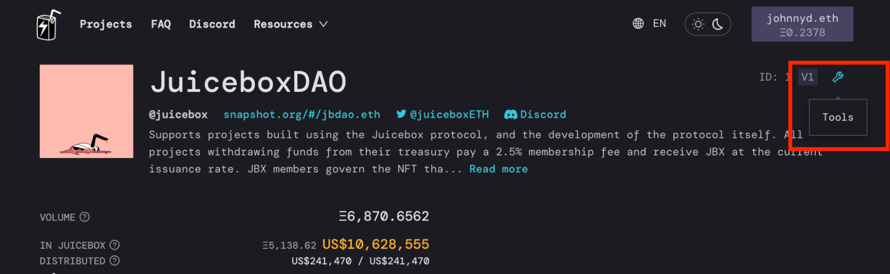

---
slug: how-juicebox-for-nfts
title: HOW Juicebox for NFT Projects?
authors: [johnnyd]
tags: [nfts, nft, juicebox, ethereum, juicebox project, crypto, cryptocurrency, web3]
---

# HOW Juicebox for NFT Projects?

In case you don’t know, Juicebox is the best way to fund and operate any Web3 business, especially NFT projects. If you’d like to know why we’d recommend reading [‘WHY Juicebox for NFT projects’](why-juicebox-for-nfts) if you haven’t already done so first. 

For now, we’ll be going deeper into Juicebox lore and fleshing out all the weird and wonderful options, looking at how to leverage them ideally for an NFT project. By the end of it, you’ll have set up a system where: 
1. Buyers of your NFT will automatically receive a quantifiable stake in your project’s treasury in the form of ERC20 tokens.
2. People can invest in your project without having to own an NFT. 
3. Automate payments to your key team members and display them transparently to your community. 

In this article you’ll learn:
* How to create and configure a Juicebox project suited for an NFT collection
* How to link royalty fees from your NFT sales to your shared Juicebox treasury

## 1. Create your project

*[https://juicebox.money/#/create](https://juicebox.money/#/create) or [https://rinkeby.juicebox.money/#/create](https://rinkeby.juicebox.money/#/create) (testnet)*

I’ll go from the Funding cycle section of our create flow and recommend some possible starting points for your NFT project.

### 1. Funding 

#### Funding cycles
We highly recommend using a funding cycle. This is the time period over which distributions will be made and other Juicebox settings such as the discount rate will be applied. Common funding cycle lengths are 1 week, 2 weeks or 1 month.

#### Distributions
You can specify the amount you’d like to distribute to each member of your team per funding cycle from the treasury. If you don’t raise the total amount of funds you’ve planned for your whole team, then each team member will be paid the percentage you’ve specified for them from any funds you have raised. For instance, if you planned for Mike and Bob to get 1 ETH each per week, but you only raised 1 ETH total in a certain week, then they will just get 0.5 ETH each. 

If you’re opting not to go for the shared treasury approach, you can route all funds from the treasury straight to the owner, or a percentage cut to any other wallet address.

### Token
#### Reserved rate
As mentioned earlier, whenever new tokens are minted as a result of someone buying an NFT or contributing for tokens straight up, this percentage of those new tokens will be reserved and the rest will go to the buyer. By default, these tokens are reserved for the project owner, but you can also allocate portions to other wallet addresses. A reserved rate of 50% will ensure the project owners maintain a majority share of the treasury and may be a good option for your project. 

#### Discount rate
The discount rate incentivises people to get in early on your project. It controls how the issue rate of your community ERC20 token changes over time. A higher discount rate means people who buy your NFT in the early days will receive more tokens / ETH than those who come in later. An exact figure is hard to give, but with a funding cycle length of 2 weeks, a discount rate of 10% may be a good place to start.

#### Redemption rate
This redemption rate encourages token holders to hodl and stick with your project token for the long term. On a lower redemption rate, redeeming a token increases the value of each remaining token, creating an incentive to hold tokens longer than other holders. Similar to the discount rate, you’ll have to gauge how aggressively you want to pull this level, but a redemption rate between 50 and 75% is probably a good place to start. 

### 3. Rules
#### Pause payments
You probably don’t want to check this. Check it only if you want to hold off payments for a certain period after you create your project.

#### Allow token minting
You probably don’t want to check this either, it allows project owners to mint any amount of tokens to anyone on demand. Whenever you have this enabled, your project will have a warning flag on its Juicebox page warning contributors of the possibility of their tokens being diluted. 

#### Reconfiguration
This is important. It restricts how long before the next funding cycle reconfigurations must be submitted before they are able to take effect. For example, with a 3-day delay (a good starting point), a reconfiguration to an upcoming funding cycle must be submitted at least 3 days before it starts. It’s a great way to ensure your community against any malicious owner behavior. 

## 2. Create a payable address

This will create an Ethereum address that can be used to pay your project, rather than having to go through the Juicebox interface. It will be necessary in the model of the Juicebox NFT project we’re going for, since you will use this address as the destination for your royalty fees. You will be prompted to do this when you create your project, but can do it later at any time in the ‘Tools’ section of your project page pictured below. 

## 3. Do your thang on Opensea, or wherever. Send royalty fees to the payable address. Let the magic happen 

And that’s it! Congratulations. You’ve set up a system where buyers of your NFT will have a quantifiable stake in your project with community tokens (ERC20), and have allowed people to invest in your project without having to own an NFT. 

## Conclusion

We hope you’ve enjoyed digging into the details of Juicebox and how you can leverage the protocol for your NFT project. If you’re interested in having a crack at the setup described here, [have a play on Rinkeby](rinkeby.juicebox.money/#/create). If you’ve still got some questions, come shoot us a message in our [Discord](https://discord.gg/juicebox) or arrange an onboarding call. As always, happy Juicing!

*Disclaimer: This is not financial or legal advice. As always, speak with an expert and do your own research.*
