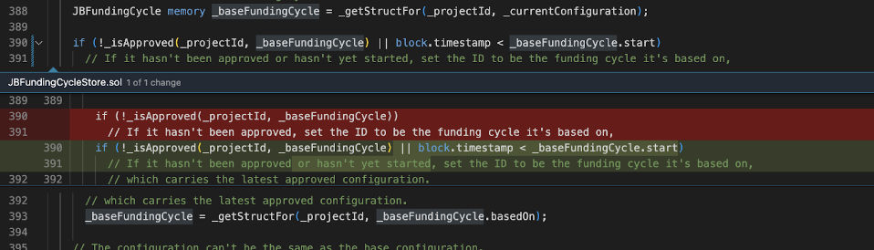
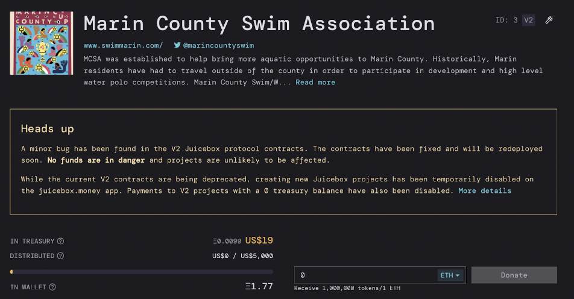
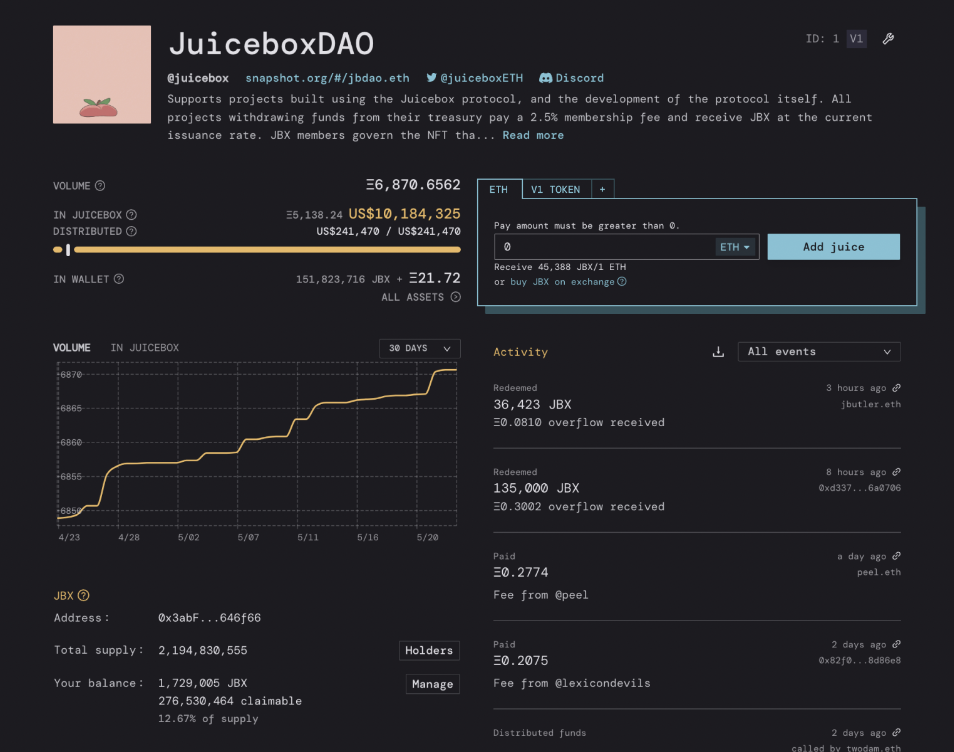
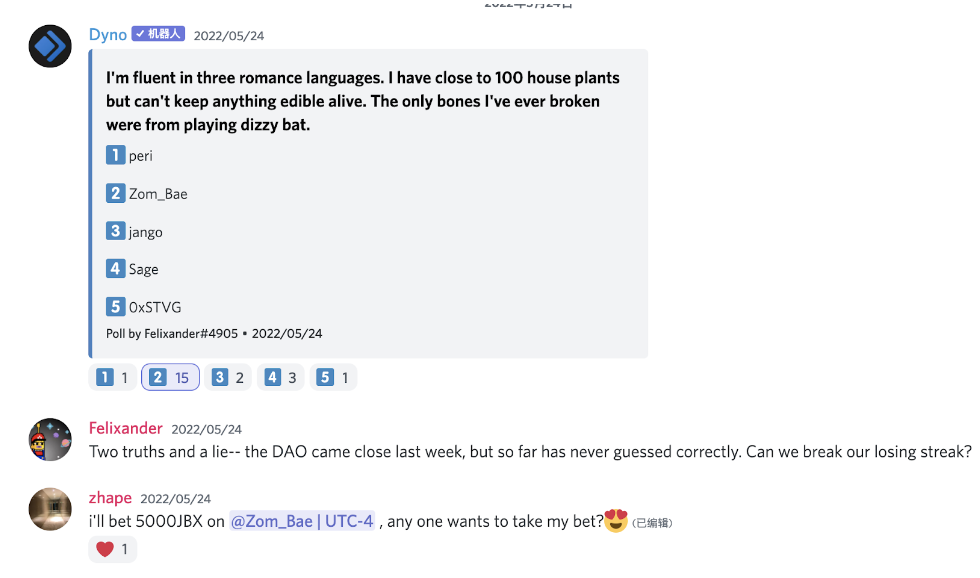

# JuiceboxDAO Town Hall May.24, 2022

## 1. A bug saga by @jango 

Jango: This morning STVG posted at the loose_thoughts channel: What if we could pause a project mid-Funding cycle? He was trying to play with the Marine County Swim Association project(this is a sweet event pulled off by STVG) to pause it since the event was finished. And through a series of botched configurations, the project ended up in a really weird state. The project’s current funding cycle is set to start on May 28th which makes no sense as the current funding cycle should always be active. 

So at this point, something is for sure up or at least not served correctly or the front end isn’t interpreting correctly. That’s quick to check. The etherscan.io confirmed that the current funding cycle starts at a later day. I went to check the unit tests and there were a bunch of cases that I felt this was trying to cover and still passing. So I tried to create the situation exactly and was still struggling to do so. What ended up being the exact step to follow to recreate the bug which I eventually found was: if you create a funding cycle or configure a funding cycle with a duration and then let it roll over to the next funding cycle without reconfiguring, now you’re in the 2nd funding cycle, now you’re in the 2nd funding cycle of the 1st configuration. Then you configure the subsequent one, and before the current cycle is over, you reconfigure the subsequent one again to override the previous configuration. If you’re in this exact state, the 2nd reconfiguration, instead of being based on the 1st FC which you kinda rolling over onto, will be based on the funding cycle you are going to override. 

That puts us in a weird state. The edge case was not covered in the tests. So I quickly wrote a test and confirmed it, before I found the one line to add to the contract to fix the problem to make the test pass, which I’ll post here:

So once we identified the problem, sorry I'm kind of doing a realtime postmortem here and I’ll write this up later, then we can start to think about the solutions and consequences. Luckily V2 was deployed only recently and there are only 27 projects at the time. And most projects don’t have large volumes in their treasury either, the bug doesn’t affect the treasuries so funds are all safe, too. 

All we are gonna do is letting these projects know that this condition exists, and from our point of view, we should probably make the adjustment in the funding cycle store which is a dependency like all other contracts or the core contracts in the ecosystem which is gonna nudge us towards republishing and redeploying the V2 contacts. 

It’s not 100% sure that we need to redeploy the project contract, which will be nice with all the NFT stays. Even if we do, we can get in touch with all these projects, make sure they can redeploy on the new version, make sure funds get moved over and make sure token holders get airdropped the new supply of the token.

This comes in the name of diverse conversion stuff we have been talking about. We know we are working with fragile and delicate infrastructure. I am happy to catch this very early on in the process, as this V2 stuff just gets trickier over time. And then obviously if you  were to know about it and think about it maliciously, it’s an exploit if you want to use it in that way.

A big shout out to folks involved to kinda come through and help once we wrapped our heads around the issue. Peri came in right away and adjusted some of the front end to make sure new projects can not be created on juicebox.money. And shout out to STVG for clicking a button which you described as chaotic and you weren’t really sure if you miss-clicked a few things, or you did a couple of things twice because you forgot to do it. That ended up showing us the way.

It’s pretty mind-blowing that that was a test case we have yet to cover. And it’s hard to believe there are any more of these lingering. The scope of these contracts is pretty tight. I think V2 actually removed bits and pieces of funding cycles, so the V2 funding cycle store is way leaner than the V1 one. I haven’t checked if the contracts of V1 have the same vulnerability in it, but I actually don’t think they do because that piece of logic got reassessed. 

@filipv: Huge shout out to everybody esp. STVG. This is so good that this was found now instead of 3 months from now.

@0xSTVG: I’ll ask my original question. Is there a way to pause? I’m in a 5-day funding cycle, I reached my goal so I wanted to just pause payment even though I am in the middle of the funding cycle. I can’t do that, I can pause it but it’s going to take effect only when the current funding cycle is over.
@jango: yeah, you can set up a pay delegate to revert the transaction if you’ve met a goal, you could write an extension that just does that if you want. But by default you can’t. Once we put it on the shelf then you’ll be able to pull it off the shelf and use it, but we have to build it out first.

It feels like it’s at a lighter moment now. Most of the morning was pretty tense on my end at least, and obviously we take these things very seriously, make sure we’re articulating this stuff correctly and documenting that correctly. I think we are still all gonna make it.

All V2 projects on the site currently have a sweet alert on them. Hopefully all the communities running on it, not just project owners we reached out, see this warning and get a heads up for what’s going on. Thank you Peri, for coming through.

 ## 2. Demo of veBanny by @0xBA5ED: 
 
I’ll give a quick refresher on what veBanny is for, as I don’t know if everyone here has heard about or seen it before. So, veBanny is a way to make sure everyone who’s voting in the governance is focused on the long term instead of the short term. It’s a way to lock your tokens, the longer duration you lock for, the more voting power you’ll get. When you do that, you’ll get veBanny NFT to represent your locked tokens. 

(Screen sharing of demo starts)

In the future you don’t have to receive the ERC-20 to lock your position. And it allows the public to extend the lock.

@filipv: Can you explain very quickly what a public extension is?

@jango: By default, once you’ve created a lock, then it’ll linearly decrease when time ticks on. Let’s say you lock it for 100 days, tomorrow the lock will be 99 days. So to get the full voting power, which is a function of how many days between now and the end of the lock, you’ll want to extend the lock back to 100 days, which is a transaction that needs gas. But sometimes if you have someone to be able to go in and send that transaction to extend your lock, you can set that flag to True. 

If you intend to keep a locked position, maybe you have a voting habit, or someone who can easily afford that transaction can go in and extend it for you. Or if you don’t choose that, we’ll have control over it so you can inch toward liquidity of your position at the rate that you choose. That thing was added as a result of discussion when this was being designed, that a lot of people want to keep their voting power full, but they might not want to be sending transactions regularly and this is precautionary. I don’t know at what frequency people will want to send that extension transaction on their own, but it was a quick flag to add that didn’t open up a lot of weird complexity, so we put it there.

@filipv: Is that something that can be reconfigured? Can I send a transaction to turn off the public extension on a position that I already have?

@jango: The owner can change that whenever.

@0xBA5ED: So here it is, I own it(finished locking position). So I’m going to take a pretty big risk right now because I haven’t tested this on the testnet yet. Because the minimum duration is a week to lock, so I made one veBanny a week ago. Just one, so I haven’t tested it yet. We’re going to redeem it, we’re going to unlock our tokens and redeem them for ETH from the overflow in one transaction. So let’s see.

@jango: This is another cool feature of the ve mechanism that is different from the traditional Curve ve mechanism on which this is based. Since Juicebox has redeem functionality, you can redeem your treasury tokens for the underlying treasury asset. At any point you can still redeem your locked position for the underlying treasury assets, independent of whether it's locked or not. So you can have your tokens locked for a year, you’ll be able to get your JBX back until the year’s up. But you can burn your NFT to get your JBX to get the underlying treasury asset whenever.

@0xBA5ED: Exactly. So before I burn it, I thought that we just show the voting power actually decreasing. So this is my current voting power and every block that passes it’ll decrease. So this decreases linearly until all my NFTs expire, then I won’t have any voting power left.

@filipv: So is voting a function of block number, or a function of time and it’s just updating on block numbers?

@0xBA5ED: It’s a function of time operating on block numbers.  (redeeming…) So here it’s gone already. As you can see I burned the NFT which also burned the JBX that was locked and I got the ETH from  the overflow. I’m very happy that it works, actually I haven’t tested it yet. I know it was going to work, but still it’s a bit scary to do a demo live for the 1st time.

@Felixander: A quick question in what jango was talking about, but let’s say somebody buys an NFT and they lock 100 days, and on day 75 they want to get out and they burn everything. So you can burn the NFT and the JBX. If they went in let’s say for 100 dollars, then on day 75 if they burn everything they are not gonna get 100 dollars back right? Is that gonna depend on the value of JBX or how does that work?

@jango: They’ll be able to, all the underlying JBX are gonna be redeemed with the exact same function that the treasury normally redeems at. That doesn’t decrease linearly. The idea is probably the value of the JBX or the NFT, it’s literally the floor, so you might find more value in NFY by selling it on the market.

But the point of doing this is because they were functionalities actually fairly meaningful in the Juicebox ecosystem since we’re minting JBX open-endedly. So someone can come in right now and put in like 6m dollars worth of ETH and they basically get 50% of the JBX supply or whatever. If they weren’t trying to coordinate with the rest of us, they could take everyone’s assets then basically use that big pool of JBX to control whatever was there before. The point of redeeming is that if somebody does that in a way that’s not trying to integrate with the current system, then anyone who currently has JBX is basically getting a shit ton of money from this person who comes in, so anyone who doesn’t want to be a part of that ecosystem can redeem basically and leave with a big chunk of what was just poured in. So this is in a way to disincentivize this takeover thing. So we need to keep that mechanism in place regardless of if JBX is locked because if we lock it and don’t keep that mechanism in place, that vulnerability becomes larger. 

@Felixander: One more question for the NFT profile page. Are we making a difference between different Bannies, obviously they have different histories and stats, or are we putting that in the NFT profile page or is it gonna be the same page and the info exists somewhere else on a website or something?

@tankbottoms: The thinking was just keep the metadata inside the veBanny strictly about Juicebox with the exception of the name of the character, the model and the description will be added as well as these characteristics, shadowness etc. Everything in the metadata for the token will be related to Juicebox and will speak about Juicebox. There’s a location where we could put a URL in the description in the external URL so that in the opensea UI when you go to a detail page you can jump to it. The thinking was to keep it specified to Juicebox. With that said, there’s something you can do when you load up a web page with CSS and Javascript. I am trying to do some animation with the token, so when you go to a detail page, we could put a hidden link in that people can click to jump to Bannyverse.

@Felixander: So the metadata will be the same except for the name? Or will the description model also be different?

@tankbottoms: All tokens will be unique to the lock duration. There’s 300 tokens of each range, e.g. 0-99, 100-199, up until 100m and there are five locked positions for each token. Those 300 will have metadata that says who the character is, what the duration lock is, their motto and their history. The name of the token will be the name of the character.

 ## 3. veBanny Front End by @Jmill:

 (demo undergoing……)

We have a deployment of this to Rinkeby now. I’m working on a contract reader actually populating those with real user data and then working on the transactions after that. The goal right now is to spend the next few days working on the contract reader transactions populating with real data and just moving the component around to where they need to go in the application and getting the front end of this at the door. 

@mieos: I think this looks pretty great in this little side panel. I was skeptical about it, if we’re thinking how projects could launch a toggle over to set a locked voting token option and this sort of pops up in the UI of their project. Maybe it’s a lot of info and there’ll need to be a lot of education that goes with their community, but it’s great that it can all happen right here. For what it’s worth, I think it looks pretty good. Maybe it’s because I understand it, but it looks nice to see it in action.

@Jmill: I do agree with that because the flow for almost everything project management related is that it never takes you to a new screen entirely. Any other configuration you’re doing is out of the drawer or model, so you know that we can keep that paradigm for this also. I think it’s good that the actual controls of it are quite simple. If the user has 10 positions, there’s a good way to show that here without making them scroll forever.

@jango: We’re also getting rid of the delegates onchain in this contract, which might allow us to really get rid of it from the UI as well and we’re managing the delegates via other means like Snapshot and potentially to other stuff.

@mieos: I guess I missed that bit. I think that’s great, certainly simplifies the experience of a person who doesn't need to learn what it means to delegate or take part in that same moment.

@jango: At this point, I think there’s still some research work for filipv on the best means. The Snapshot delegation strategy seems compelling, and there’s other schemas we’re thinking about. I think the goal of all this stuff long term is to get rid of the multisig. To get rid of the multisig we have to do some kind of on chain voting, and on chain voting can be expensive, so we have this delegation. I think there’s some creative ways we’ve been bubbling up in several veBanny related threads that seem really promising. The delegate stuff was a blocker for this to the voting weight stuff. I’m pretty confident that we can get rid of it from the design scope for the front end for the time being, we’ll work it back in later.

@Jmill: Just from a user’s standpoint, it’s a really touchy issue of how you open up this delegate picker and how do you decide what to show, which delegate option to show to the user. There wasn’t a really great answer there as far as implementing that in the rest of the UI. I’m just working from the mocks but it’s pretty easy to remove the delegate stuff.

@filipv: ENS sorted alphabetically and free delegate. One thing I should add about Snapshot delegation. There’re hybrid solutions you can do using safe snap to have on chain execution, but you still need off chain queuing, so I’m not confident in Snapshot delegation as a strategy long term on chain governance. It’s good for hybridized stuff and getting close to there, but ultimately there does need to be some form of delegation if we want to be fully on chain. But I imagine there’s other layers we can think about. 

@jango: Yeah, the disposable token strategy (see [here](https://discord.com/channels/775859454780244028/961007548553637970/974046109615931432)) is very compelling to me. For now this project has a lot of merit and we still can lean on the same points of vulnerabilities that currently we are at. We’re having a multisig, having an on chain voting which seem fine tradeoffs for the time being as we work towards to study our future.

If we can eventually have these as soon as people start having these Banny characters representing their position in governance then we’re going to see these characters everywhere because it’s kind of like an identity in the community. So as you start voting on Snapshot, we can also roll out interfaces and take inspiration for the work that folks at NounsDAO are doing to kind of participate with your Banny and lean in to the stuff WAGMI is doing to extend that even further.

@mieos: I just love the idea of getting the Bannyverse and these veBanny off the ground, but I can’t wait till the next DAO actually just uses the same implementation of voting and either uses WAGMI or somebody else to create these stake tokens. I’m excited about this rolling out to other Juicebox projects and creating value from.

 ## 4. Product Roadmap by @aeolian: 

@jango: The veBanny stuff is great but we can’t ship it yet because we don’t have V2 tokens up yet. And all the stuff that’s up depends on the V2 JBX being out. So we’re in a transition period of V1-V2. We’ve got to transition the V1 JBX to V2 JBX, and we’re currently talking about a few designs to do it. Coming off product roadmap discussion we’ve been having in the strategy channel, we are gonna focus on making sure folks have an easy way to pay their V1 JBX to the treasury and get their V2 tokens in return, and making it easy for other projects like SharkDAO for instance, to do the same. That way we can get a lot of V1 projects who are still using their treasuries in earnest onto V2 and then build these new features on there their folks can use. So I think that’s the area of focus for the time being and there's a couple of ways to go about it. Aeolian do you want to hit up the current thought process?

@Aeolian: Totally. Quickly from Peel’s perspective and the front end perspective, as jango has said, the immediate focus is getting this V1-V2 migration flow done, designed and implemented. There’s a few different ways to go about it and jango said some good ideas in the strategy channel which everyone can check out. That’s our immediate priority. So Peel is going to return to development life cycle which is going to basically in line with Juicebox funding cycle, we're currently on FC#22, and the work we get loosely scheduled, everyone can check out here on our Github project.

There are 3 main things we’ve been working on:
V1-V2 migration flow,
coming up with solution for handles for V2 projects which includes cool crossover with ENS names,
some iterations on payout splits UX that making that a little more intuitive which is pretty exciting as well.

We will be focused on these for the next 2 weeks to one month, ironing out little bugs that have come up in V2 and refining experience alongside these big features.

And beyond that, we had really good discussions in the strategy channel. Definitely encourage everyone to come hang out there and drop ideas.

I think the overarching alignment is to figure out how to get more activities on the network and more long term oriented activities. I still think there’s a few obvious things that we can build initially that have surfaced, and one of those is the multi token payment terminal stuff. 

“Roadmap is coming together in a loose way”.

@jango: Everything is great. It’s occurring to me that finding the transition between projects is fairly meaningful to right patterns or timeing or whatnot. It’s sometimes not just a matter of feature itself but where it fits compared to other things.

So all these little motivations can all play into the roadmap in an interesting way that certainly takes the high level metrics we care about into account. So it’s absolutely a luxury to have 4 or 5 really delicious projects on the finish line right now. But figuring out a way to actually take them through the finish line in a way that makes cohesive sense is gonna be a lot of fun and can take a lot of patience from a lot of folks who have been working on each of these projects. But I think many of them don’t really have and might find themselve wanting something if we don’t do another piece beforehand. If we try to do them all at the same time, it’s probably gonna be like everything somewhat half baked. We’ll revisit this discussion probably for 15-20mins in every Town Hall to give updates on where we are at.

I think this line of thinking at least makes cohesive sense from our current standpoint, but can always change over time.

 ## 5. NFT Framework by @tankbottoms.eth: 

(demo undergoing……)

I’m thinking maybe anybody can make the NFT and associate it with a project. But in the recent discussions, originally any NFT that came out of this system is tied to a project, but there’s a bunch of feedback with a basic point that lets people do just whatever they want to do. I’m really looking forward to Aeolian's splits. The idea is making an NFT as a project owner or as a project contributor for a project to sell on the market place of Juicebox. There are everyone’s ideas to roll into advanced mode or simple mode. There can be instructions on image NFT, music/video NFT, and p5.js. 

As you can see, it’s just a lot of stuff. If you want to learn what to do, you can go to the create mode, and basically go through a PFP, or p5js or music, then create your collection to redefine your asset, review and deploy it and then price it and attach it to a project.

@mieos: Where would a Juicebox project contributor who wants to send some money to a project go? Where would they go to purchase this NFT? How would that look?

@tankbottoms: For things that need to be minted, this area where you can contribute could be a tab where you can mint an NFT. There’s also the idea that makes a kind of landing page for a mint, then there’s also the idea to have a Juicebox marketplace like Jango did. There’s definitely more experimentation where it’s gonna leave. The core ideas are making this tool pretty fancy and giving projects the continuous reasons to get ETH going into the treasury. They don’t have to worry about the whole split thing at some point after they do their NFT thing, like how much you want to go to the treasury or go to your wallet. I think that would be super useful.

@mieos: I think the NFT capacity inside juicebox is gonna add a lot of functionalities for projects and sort of just simplify this heady shit for staking projects. And it’s just a lot and I think it just helps democratize getting contributors in the door and checking the boxes that make sure their project is strong and has all the utility. 

@tankbottoms: I hope so. I mean I don’t wanna work on stuff after this ever again, just put in everything I know how that you can milk out of an NFT and the tool to simplify it. I think in advanced mode or simple mode, everything will have a lot of feedback in terms of how it actually gets implemented.

@mieos: I’m curious, Nicholas, do you have thoughts about this? You’ve seen a lot of projects roll out with NFT. Does this strike any chords inside you?

@jango: This is definitely a big thesis on how the community can derive more cash flow. But it’s kind of a self-contained project for the time being, for sure it will make its way to product, once a lot of these granular things get knocked out in the next several months. I think this project could certainly have life on its own, maybe on its own site for experimentation to start. I feel very confident about the product per se and it’ll be unfolded in due time. 

@nicholas: That was really what I wanted to say. It’s so powerful and has so many tools in what you build. You’ve created all-in-the-best class creation tools in one tool. I know you’ve got ideas about on chain also, so it’s even like tools that barely exist and are separated from multiple products. If you are a generative artist, there’s a couple of things out there that you can use. There’s a few artblock clones, then there’s a manifold that has something, there are private companies that can work with you, is it good enough to be in direct competition with those things like a choice on people’s mind? Or is it like I want to do a Juicebox project and I want to fund it with NFT? I think the truth is probably it can do all of those things. I think probably just have it on its own site, as it’s going to be difficult to integrate elegantly. I want to think more about what interfaces make sense for it.

@filipv: I wonder, looking at this demo and the demo by Jmill earlier, if it makes sense to start implementing some form of project page customization for project creators where project creators say if they want to put NFT market interface on their project page can switch on something in the metadata and then can configure what they want to show on their pages?

@jango: If you look at the screenshots shared(below), I am very interested in the same idea. And I wonder if it’s gonna be self-contained in the idea of a payment terminal, so maybe instead of imaging the whole site as what you can bring your payment terminal which is basically a functionality to move funds into the treasury according to some means. The customization is at least scoped to that box, this is a mock that we’re still playing with ideas here.

@filipv: I think this is so exciting for existing projects, I know so many projects, like SharkDAO, have spoken about doing NFT issuance on Juicebox. This is pretty crazy. I don’t think anything like this exists in general and something like this could really draw people into the Juicebox ecosystem. Like Nichola said, this is a combination of all of the best. And the fact that this is in Juicebox potentially is super super crazy.

## 6. Dune dashboard of Juicebox logbook share by @twodam: 
New dashboard: [Juicebox Logbook](https://dune.com/twodam/Juicebox-Logbook)  
Display actions across Juicebox protocol with details, support search, sort and filter.
Check use-cases below:
* default view, actions sort by time
* payments with note
* filter by ENS/address
* filter by project handle

## 7. Quizz time:

And the answer is…… @Zom_Bae!!!!

