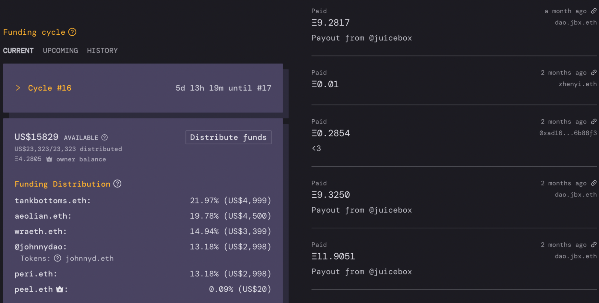

---
slug: why-juicebox-for-nfts
title: WHY Juicebox for NFT Projects?
authors: [johnnyd]
tags: [nfts, nft, juicebox, ethereum, juicebox project, crypto, cryptocurrency, web3]
---

# WHY Juicebox for NFT Projects?

Juicebox is an extremely flexible and powerful Web3 protocol made to fund and manage shared treasuries. It has been responsible for some of the biggest names in crypto community fundraising, including ConstitutionDAO, AssangeDAO and MoonDAO. Funding and operating an NFT project with Juicebox is an especially effective way to leverage the protocol, providing massive benefits to both owners and their communities. In this article we’ll cover why, and [in a follow-up article, we’ll cover how](how-juicebox-for-nfts).

In this article: 
1. Basics of the Juicebox protocol.
2. Why Juicebox NFT projects are better.
3. What does it cost?

## 1. Basics of Juicebox
Juicebox allows people and communities to crowdfund their project and give their contributors a stake as community tokens (ERC20) in return. Once funds have been raised, the protocol can be leveraged to automate payments from the treasury in a controlled, transparent and decentralized fashion. 

## 2. Why Juicebox NFT projects are better
Juicebox NFT projects are a win-win for both communities and owners. There are countless ways you can configure your Juicebox project for your specific goals, but here’s a general strategy we recommend for NFT projects: 

Instead of sending your NFT royalty fees directly to the owner’s wallet, you can send them to a shared treasury owned by your community. Upon buying an NFT (and paying the royalty fee), the new owners of your NFT’s would automatically receive an amount of your community tokens proportional to their purchase amount. The more someone pays for an NFT, the more tokens they receive. This gives your community members a formal and quantifiable stake in the shared treasury - your project as a whole. Your community could also contribute and gain stake in your project by just buying tokens, not necessarily having to own an NFT. 

### For communities 
#### Token value 
You can use these tokens for anything you want, perhaps governance, raffles or exclusive access to future drops. But a unique feature of Juicebox is that it allows the option for these tokens to be redeemed by community members for a portion of your project’s treasury. As the pie grows over time, a contributor’s tokens will be worth more. Your community can gain on top of just the increase in value of their NFT’s.

Having a shared treasury is optional, however, and you could instead just have all royalty fees sent to the Juicebox project route straight to the creators. In this case, the token your community receives could not be redeemed for any ETH. 

**Your community can gain on top of just the increase in value of their NFT’s.**

#### Trust and transparency 

Firstly, a properly configured Juicebox project makes rug-pulls impossible. You can give your community time to react before any changes to your funding and spending parameters take effect. 

Additionally, your Juicebox page shows exactly how all your funds are flowing - how much and where it’s coming from, and where those funds are subsequently being spent. The only way funds can leave the treasury is by configuring and scheduling a payment, for which your community will always have time to react to. 

*Spending (left) and income (right) shown on a project’s Juicebox page*

You may be asking, *“Ok I see the benefit for my community, but what’s in it for the owner?"*

### For owners

#### Maintain a high stake in your project using the Reserved Rate.

If you choose the option of your token holders being able to redeem from a shared treasury, we should mention that as an owner you can control exactly how much stake you maintain of this treasury over time. The reserved rate allows you to keep a portion of all newly minted tokens. A 50% reserved rate means you will maintain a 50% ownership of treasury no matter how big your project gets. 

This is mostly irrelevant if you don’t want a shared treasury and to simply route all funds into the project straight to creators. 

#### Allow for people to contribute to your project without buying an NFT and, therefore, raise more funds.

This model opens up a massive and mostly untapped market of people interested in investing in an NFT project without necessarily buying an NFT. Whether it be too high of a floor price, not wanting to go through the whole selection/auction/listing process, or anything else, Juicebox opens the door of your project to these people through community tokens.

Consider if the projects like the Bored Apes had followed this model - how much more funds could the creators have raised as a result of people buying some stake worth less than the purchase price of a Bored Ape? 

How much more funds could the [Bored Apes] creators have raised as a result of people buying some stake worth less than the purchase price of a Bored Ape? 

#### Automate payments to key members of your team.

If you’re going for the shared treasury approach, Juicebox allows you to pre-program specific distribution amounts from your treasury to any ETH address, e.g. pay vitalik.eth US$1000 every week. This saves the hassle of manually transferring funds to your team from your personal or shared multisig wallet. 

Otherwise, as mentioned prior, you can simply route all funds from the project to creators and their teams. 

## 3. What does it cost?

Up front, all Juicebox costs is gas. As of the 23th of May, it’s about US$150-200 worth of gas to launch your project, deploy your own ERC20 token and a payable ETH address for you to link your royalty fees to. Then, for any funds you end up withdrawing from your project’s treasury, you’ll pay a 2.5% fee to Juicebox. But, for this 2.5% cut of your payout distributions, you’ll receive Juicebox’s native token (JBX) in return at its current issue rate. Moreover, your fee will give you a growing stake of Juicebox’s expanding ecosystem and treasury. 

## Conclusion

If this has already been enough information for one reading, feel free to tap out now. But if we’ve piqued your interest at all, you may want to read on about exactly how you’d setup your Juicebox NFT project here (https://docs.google.com/document/d/1Xqj5AyG8pZcpdtbxYfOzqwIaMNyrhQZPfVhfsUpYw1M/edit). Alternatively, come hangout in our [Discord](https://discord.gg/juicebox) and arrange an onboarding call if you’re interested in learning more. Happy Juicing!! 

*Disclaimer: This is not financial or legal advice. As always, speak with an expert and do your own research.*
