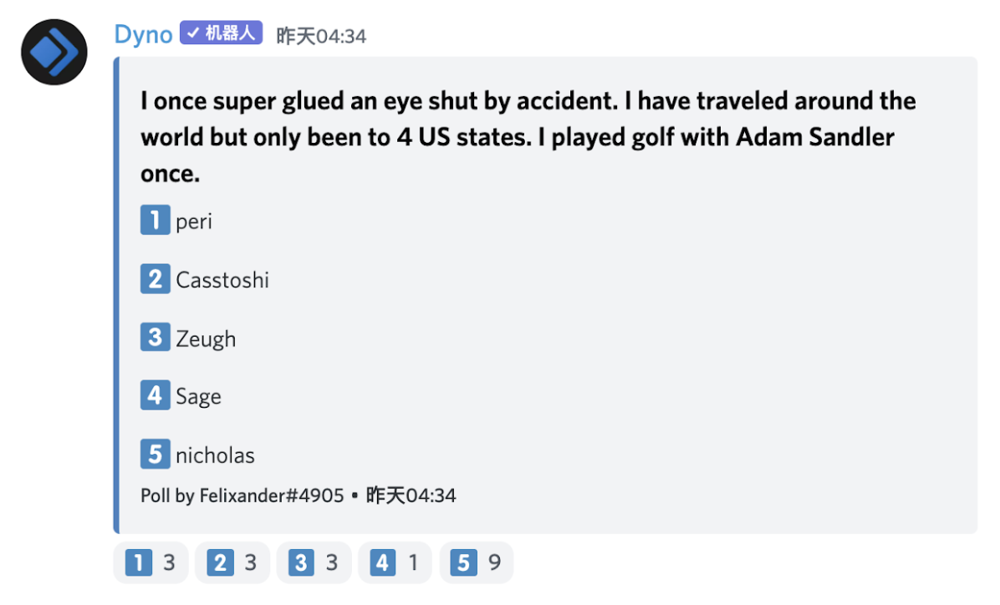

# JuiceboxDAO Town Hall May.31, 2022

## 1. Bug updates by @jango 

@Jango: The same bug update that I presented about last week that we caught about a week ago. As of a few mins ago about 95% got resolved to just the final step of re-issuing the tokens for those who contributed to projects before we re-deployed things. 

Everything is being tracked in the [postmortem](https://github.com/jbx-protocol/juice-contracts-v2/blob/main/security/postmortem/5.24.2022.md) that is the V2 contract repository. I’m very excited to tie that off and make progress on all other stuff coming up. Also project creation is back up.

filipv: I am gonna ask about litDAO specifically. Are they holding back token narration for all projects right now?

jango: We’re gonna run a script to help go through play by play of what we’re doing. We re-deployed basically all the contracts except for Juicebox projects(so they can keep their NFT i.e. the ownership to the projects) and a few auxiliary contracts that don’t have dependency. We re-deployed the token contract, funding cycle store, the terminals, etc. Once projects re-launch their funding cycles, everyone starts from Funding cycle #1 again. The front end made it very easy to use the same configurations as their previous funding cycle in the old contract had. Once they make that, they also have 0 token supply in the new token contract. But several projects have already received funds and started distributing tokens.

The original plan was to have project owners initiate a few transactions to airdrop tokens to their token holders, which is super doable but requires 3-4 transactions and it’s a bit complicated. In general, the scope of the problem is very small, given where we are in the protocol deployed a few weeks ago. So instead, I’m gonna send a few transactions that we scripted after this Town Hall that’s gonna deposit and basically re-created the activities for each project. Let’s say moonmars have received 10 payments each with its memo and it beneficiary of token. We’ll just send those out again. And from the deployer wallet as we run the script, we will pay in some ETH and set the original beneficiary of tokens as a beneficiary. So once all the activities are up again, then the token balance of each project should reflect their old token balance. I’ll open a proposal to refund the deployer.

@filipv: So are we repaying all the balance that all the V2 projects have received so far?

@jango: I think the total will be 11ETH if all projects are to relaunch funding cycles, which is a prerequisite, and then we’ll drop the funds in both as a bonus for everybody for the hiccup, and also thanks for the patience throughout this process. I think it’s better to solve this problem with money, than to cause poor UX, and I think it’s worthy given its scale. But this also taught us a lot about how to solve this problem given a larger scope. That loss is in lieu of communication headaches that cause us to make sure that the projects are clicking the right button and not getting themselves into other nuts. 

@filipv: Are we doing reimbursement for gas fees associated with redeployment and project updates?

@jango: Yes. The big one is projects that have deployed ERC-20, which is the most expensive transaction. We have a list of projects that have that before, and we’ll drop in 0.2ETH in their treasury, which is part of the number I quoted before. After this call, I’ll run it and we’ll be super in the clear and make moves towards the stuff we were working on before.

@filipv: Last question, what’s going on with the ETH in the V2 projects right now on the old version of the contract? Can project creators just distribute it if they’d like to, or figure out what they’re gonna do with it?

@jango: For the most part those have been distributed. I went through to empty those out as the UI no longer interacts with them. You can always go to etherscan.io to pull them out. I think litDAO has a 100% overflow, so any funds in there can be redeemed by token holders. So if you did contribute to the DAO before, it’s now a fine time to go and redeem, or they can submit a reconfiguration on the old funding cycle to raise and pull funds out. It’s the bonus we’re going to give them if they want to go to the trouble to get those, which is for them to choose.

Once we found this bug, it was tempting for us to just keep our heads down, mitigate it and try to fix it. But communicating with projects and making sure everyone understands what’s going on is important, so it’s certainly cool to do stuff and prod. 

It’s still pretty incredible that we found this bizarrely niche bug this early on. I’m pretty confident here going forward. It’s kind of weird to start and then already have a bug. I definitely understand if there’s a sense of hesitancy. I’ll have to work through that, give it time and put weight on it incrementally and regain trust in ourselves. I feel pretty good about it.

## 2. Morgenstern’s Ice Cream event by @Zom_Bae and @Kenbot: 
 
@Zom_Bae: If you haven’t been keeping up, Morgenstern’s Finest Ice Cream is hosting a JuiceboxDAO event for three days over NFT NYC. We, as a DAO, got to vote on 6 custom unique ice cream flavors, which is pretty cool. Check out [this link](https://juicebox.notion.site/ICE-CREAM-FLAVOR-SUBMISSIONS-c84ed139d9a64bf68099a210942b98db), and submit your crazy wacky creations by June 2. On that day we’ll get a list compiled and vote on Discord for the top 6, which are going to be tweaked and refined by Nicholas Morgenstern himself and then be served at our event over the 3 days.

Kenbot and I over the last week have been really digging into this and finding a way to make it more than just an ice cream social. And I think we’ve got a really unique opportunity here to bring some really cool projects into Juicebox and get them building in the protocol, and also really get the word out for Juicebox. 

We’ve been talking for a long time that Juicebox hasn’t really done a whole lot of marketing other than our twitter, word of mouth, and the big one-off projects like ConstitutionDAO and AssangeDAO. We are still in early phases for that, but the ice cream social the way it’s building up is gonna be an event inside an event of NFT NYC. We’re going to have a schedule of things going on each day. We’d love to do some twitter space, AMA and podcast if we can.

Lexicon Devils are making a replica of this event in [cryptovoxels.com](https://www.cryptovoxels.com/spaces/344a9048-9c09-462e-9d76-f292185922a9/play) , which is pretty cool.

So any of you is gonna be in NY for this event and is willing and able and down to be a part of that, I really want you to be.

@kenbot: What we’re thinking about is we can have their windows as soon as we can get going. So we can have a week running up before the event to promote right in the space what we are gonna be doing there. The thought is who do we want to reach out to, who’s walking by that place, who’s in downtown NY at that time, and we want to capture and have them come back.

So that’s going to be ideas that we can have a theme of bringing creatives together, to open their Juicebox projects and fund their dream projects. 

## 3. Stories about BlockSpilt and NFT Berlin by @Zeugh:

@Zeugh: Me and JohnnyD have been going around for the last week. We’ve started the idea of testing the gorilla marketing tactics, by going to some blockchain, Ethereum or NFT conferences. This time we went to BlockSplits in Croatia and NFT Berlin so far. 

### 1) BlockSplits

We got to BlockSplit on Tuesday last week. First thing we swa was a panel of legal side of things about new regulations in the EU and it felt like this was the wrong place to be. We came to this event for 2 main goals. The first one was to do some user research, try to listen to people that are creating projects, and try to understand how they currently manage their treasury. And the other idea was to onboard some of them. The event ended up evolving into something we understand as Web2.5. BlockSplit Croatia was more of using  blockchain technologies on traditional startups. 

Interesting insights from BlockSplit were, there were some L2 builders from Boba network and they were interested in how we can bring Juicebox to their L2. I found it unusual that there will actually be people building L2 looking for people to go into their chains. I talked to them and onboarded them to our server. They want to come on and discuss how they could help a process like this to happen. 

Also from BlockSplit, there was a very interesting group called Resolute that focuses on web3 marketing. They got very interested in how we’re doing things and how they can help with that. I am bringing them to our server this week for them to take a look at our strategy discussion and the marketing part.

Everyone got interested in how we are doing things actually, no one has ever seen a DAO actually run and work with a profitable and functional business model. 

### 2) NFT Berlin

From BlockSplit we flew to Berlin, and NFT Berlin was the opposite of BlockSplit, where most people were not directly involved with a project, they were mostly collectors and fans of the whole NFT fever.

In there we got in depth looks at what NFT creation could use Juicebox for. JohnnyD was amazing in focusing in how we can create better models using Juicebox, some templates or preset configurations that could be useful for NFT creators, to give their buyers or investors more confidence in investing, to make sure that if a rug pull happens everyone has time to pull back. Those features made everyone’s eyes shine.

We got in touch with NFT Club Berlin. They are a big local group of NFT investors and collectors. We have follow-up calls this week to show them how to use the templates so that they can start referencing that in their community.

The experience as a whole was great beyond the event itself. We stayed for the hackathon, helped people on the hackathon deploy or understand something about our products. We got invited for the ETH Barcelona to be part of the hackathon there to help them get DAO hackathon. They are interested in having us as the main DAO on that, because we were one of those that does have an actual toolkit and a workshop and content to provide for a hackathon. 

And we faced the problem of gas fee in NFT Berlin again and again, for the fact that we only run on Ethereum was definitely a barrier for some project creators that we talked to.

### 3) Discussion

@filip: Do you feel like what you learned from those events changed your strategy? Do you still feel the same way about the strategy?

@Zeugh: I don’t know. I really don’t know, because the strategy has been going back and forth from different talks, so I’m not sure if I have a clear feeling before saying it has changed.

I definitely feel more confident on going projects to projects in an event, just talking about Juicebox, asking what people are doing and how they are doing. I learned better the right questions to ask to understand if we can provide value to them or not, and to learn why we can why we can’t.

I think the most beneficial part was the user research part beyond the few projects we onboarded. I think it was the biggest gain.

## 4. Quizz time: 

The answer is……     Casstoshi!

## 5. Hello from ComicsDAO by @gogo: 

@gogo: I’m really excited about the V2 release, and ComicsDAO will be dropping really soon. I have just to create the Gnosis and the multisig, and we’ll be dropping soon. You guys should know what we are doing. We do some cool things already with covers of ComicsDAO. You are all welcome to join.

