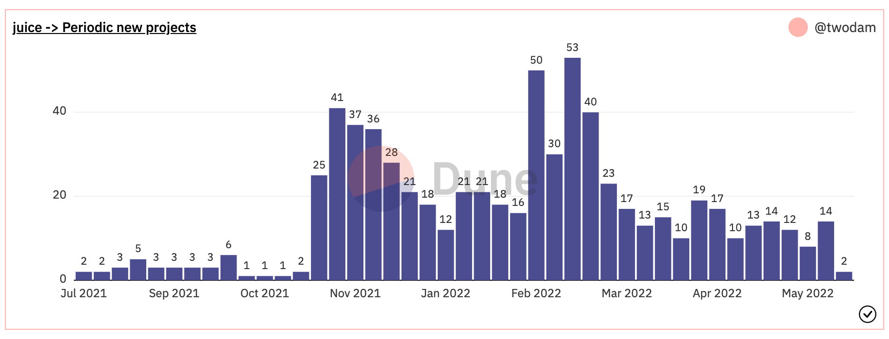
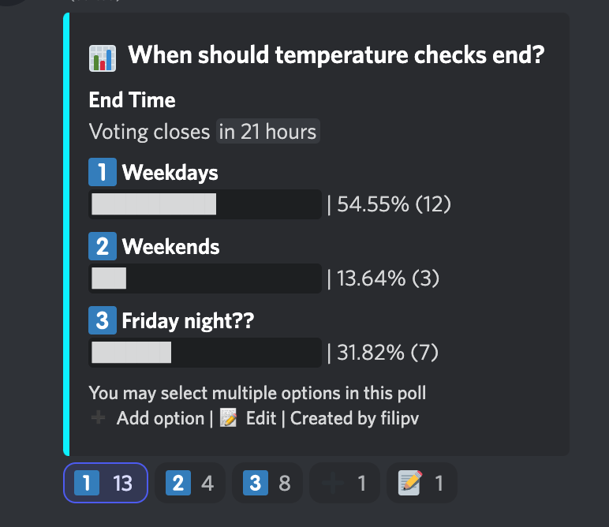
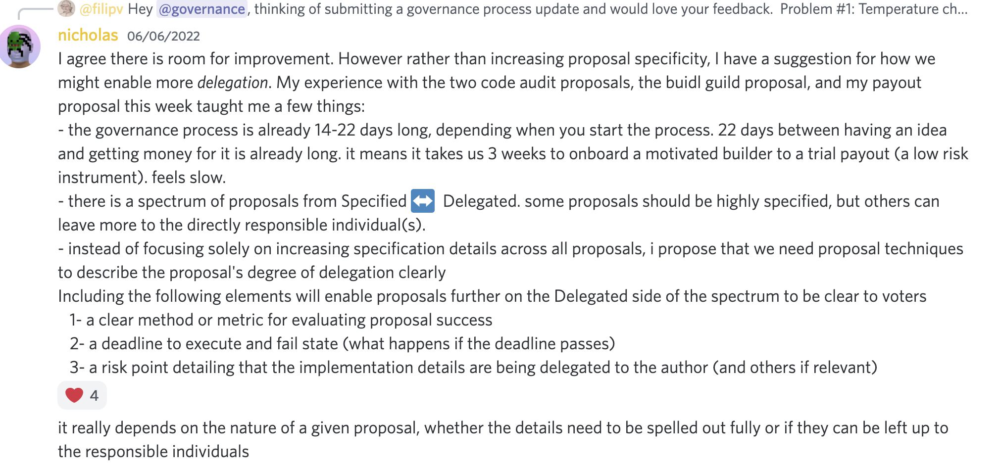
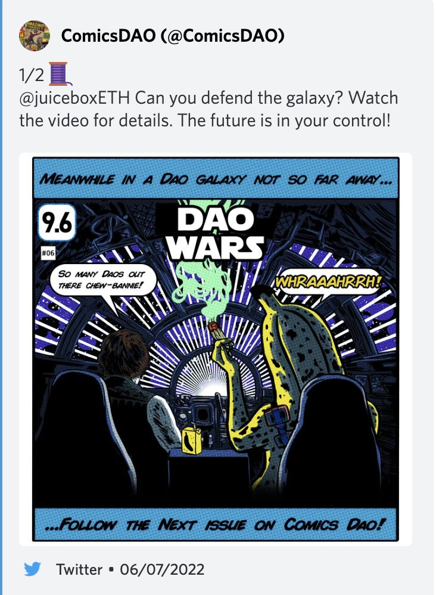
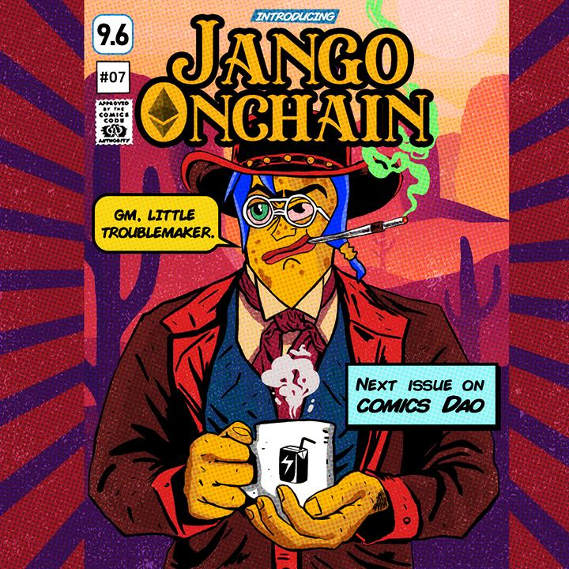
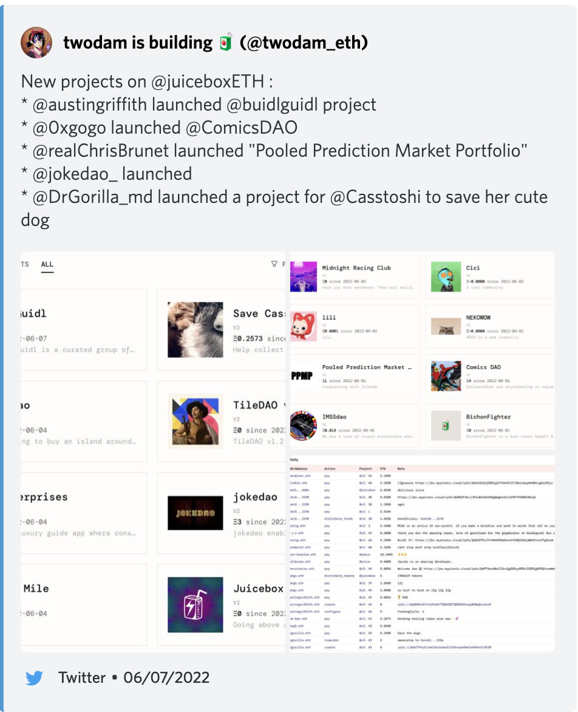
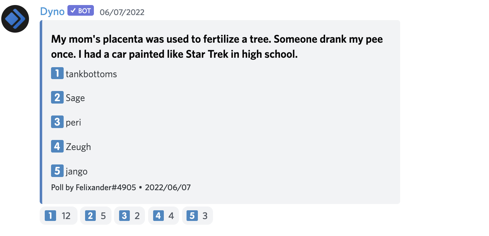

# JuiceboxDAO Town Hall June 07, 2022

## Warning of Influx of new members.

**filipv**: On June 7^th^, the Discord server of JuiceboxDAO was faced with a big influx of new members from Indonesia. According to @Zeugh, they came from several big Telegram chat groups that are mainly focused on airdrops. There might be a misintrepretation that if they create a project on rinkeby.juicebox.money and give feedback in the Discord server, they will be entitiled to some kind of Juicebox airdrop. **We don't have any airdrop currently.**

**Zeugh**： I think it won't do any substantial harm to JuiceboxDAO, and think it a great opportunity to showcase the functionalities of our protocol to these people, and to onboard some new members who are really interested in our products.

## veBanny Front End updates by @Jmill

**Jmill**: I have been working pretty extensively on the veBanny front end, trying to get it out the door. Now that the contracts are deployed, we can work to transactions and use real data.

(_sharing screen and demonstrating the process of staking tokens for an Locked NFT_)

So we're now minting this thing through the website which is cool. The stuff is all working now, and show up pretty cool.

**jango**: I've also been on the contract side of things that @Viraz has been doing a great job, asking for reviews over the tests. The tests he's writing and adding more fuzzing tests to the suite. So hopefully at this point, it's throwing a lot of use cases at the cocept. And i suppose it'll make way on to the actual final details to complete the workflow.

**Jmill**: The big thing next is to read the onchain data and get the use of NFT, and then allow them to extend their locked positions on a particular NFT. All of those are related to fetching data, about multiple tokens. We're talking about this in Peel's Discord, and right now it's implemented as ERC-721 Enumerable, but it'll probably be easier if it were structured similiar with Juicebox projects where you have a directory structure and subgraph, to look that information up without recursive calls to open by index. So that's probably what we need to start thinking about how we index these information for the purpose of front end to grab it and work with the data. 

**jango**: Yeah, that makes sense. Also from a juiceboxDAO or Juicebox perspective in Juicebox.money, we'll possibly first have to deploy their staking contract and specify the lock duration they want etc. It isn't going to be there for everyone first, they have to specify those things, so that that initial transaction to deploy a staking contract will go through a contract that somewhat serve as a directory or at least it'll file an event that's indexable to service a directory. If Peel and Juicebox.money feel it a decent thing to offer all projects over time and they should be able to interact with that same depolyer contract to get their own version of this.

**filipv**:What's the timeline looking like? Is that somehting we can expect deploying in the next month?

**jango**: We need V1 > V2 migration to do it for JuiceboxDAO. We can deploy this for an arbitrary project though. We can launch a new project and just has it work there, so you can start minting stuff, just as normal treasury and lock it there, at which point there's not much difference between test and rinkeby as we currently are. But to get the JuiceboxDAO version of this and the Bannyverse version at least from a ecosystem perspective, we need to get V1 > V2 migration, and then there might be other technical things along the way.

**Jmill**: From a front end perspective, there are a couple of things that would be helpful so that there's some kind of indexing data you can easily pull user's NFT statistics. That's a more simple and scalable way to do with subgraph query. It would be really usefull if the ve NFT contract deployer also deploy a single consolidated metadata file. Let's say veBanny has 60 characters and they all have a name and staking ranges, it'll be really nice that the contract generate that as one file that front end could grab and parse to display without going to 60 metadata files individually. That would be a quality-of-life thing from the contract side for the front end.

**tankbottoms**: We could add another function for that metadata, basically something that will conform with an NFT but also has pointers to all assets you need, because you can pick them through the JSONs however you want.

**Jmill**: The last item I have here is that we're implementing beneficiary for this, so that users can stake and put someone else as the beneficiary.

**jango**: That'll be useful for even a DAO to lock its supply, and designate other contributor or some other beneficiary for. It's cool to have flexibility. The core thing being built allows everyone on the peripheral of the project to start to wrap their heads around what situation it's gonna be when this thing is out there.

## Product prospective with @Zeugh

**Zeugh**: The Juicebox.money is a complex thing to use. I think it will be something to see that front end are more focused on some type of projects. Let's say there's a NFT project wants to launch its treasury on Juicebox, they can have a direct way for easy launch to help set it up ahead of time. You want to launch a NFT project and make the funds through Juicebox so people can co-own the treasury like tileDAO did and issue tokens for people that are minting.

Those are some of the configurations that we think we should do. That could be something like Juicebox.nft instead of Juicebox.money. And if you want to go to the hard mode and be able to configure every single thing, that's still running on the same protocol.

That's what I call the product prospective. We have a very good protocol perspective here that is building something really robust and can do lots of things. In the end looking at product level, maybe not all the users will need all of these things and having an easy way to launch might be something interesting.

**jango**: I think there's a lot of to keep improving the onboarding stuff and especially we just came out of V2 trying to start with parity where V1 was. The name of the game now is just constant improving based on our own interest with onboarding as well as pulling together other people's perspective. It's hard to be certain that it's one thing or another thing from my point of view, but without question we're going to hinge towards better alternatives to prototypes that are massively useful. Shout out to JohnnyD and Aeolian and all the people in Peel who are eager and quick to make prototypes and start discord threads so that we can discuss the improvements. And then match this with a occasional AHA moment that a few different ideas come together that make sense to a lot of folks and somehow we unlock a lot more fluidity to the onboarding process. 

I'm certainly with you that we have a lot of work to do with explaining what people are getting into, like starting with giving everyone all the information upfront and make all risks as clear as possible. Overtime we can start to reel back into some managable shortcuts. 

I think now we're definitely buckling for more long term investments both from a building perspective and the relationship perspective with other communities. I'm eager to see how that project chart changes over time. I think from my personal perspective and talking to projects, the recent lows haven't been very encouraging for projects to launch. But now that V2 is out, we're going to see a lot more of that.

**nicholas**: When I did onboarding with Austin from BuildGuild and he had some feedback about simplifying. It's a little bit difficult for someone on the outside to know exactly which simplifying approach will be successfull on the market aside from just iterating on simplifying the existing one. But I do have some suspicion that there are a larger category of people who are not so inclined to use Juicebox in its current form but might be inclined to do so for this example we're talking couple of times about NFT collections, splitting off a portion of their primary and/or secondary to Juicebox and letting the holders manage it, which doodles, cryptopunks and a bunch of other projects already do. That's a category I'm super interested in getting on the creation flow for that. It could be just like presets on what we've already got, or maybe an entirely separate creation flow where you can imagine entirely different front ends that just make creation really tight for a specific use case and then you can go use Juicebox.money's full advanced front end and subsequently managing those things but make it easier for people to get onboard. It could be pretty integrated at Juicebox.money. There's a lot to explore.

**filipv**: One thng that we've discussed that might be interesting would be if there's a way to easily import and export project configurations which Austin Griffith originally brought up, for exporting a project that was made on testnet to mainnet. That might be cool because you can use that feature to set up templates that have base project configurations.

Another thing I want to talk about is what we're discussing a lot in the chat about amount of metrics. I'm not sure how useful focusing on any specific North Star metric would be. It's very hard to encapsulate everything in Juicebox, and I think everything is conflating with each other. So I think we can take anything and roll with it, but I don't know if it's worthy going super deep into which is the best North Star metric.

**Aeolian**: I'm totally with @filipv. I think the goal I originally had with proposing this metric was not so much like "ok! Let's review this number every week!" or "Oh! it's going down, what's happening?" It's more like what we're all in some sense collectively optimizing for everything from a product, website, documentation and content strategy, the whole thing. Our goal right now is to increase the number of active projects. I agree with you that at this stage where traffic is still very low, really trying to hatch out a metric that's instructive right now. It's more to get us all on the same page.

**jango**: I think the general consensus is that it feels good to have activity. I guess you could put on a chart and optimize for it, but personally I want to think about metrics that make me lean in more in moment's notice seeing activities, and seeing folks I know engaging with other projects making me want to learn more about them.

## Govenance discussion

**@filipv**: I want to open up some discussion on the recent governance cycle, both in itself and some of the proposals. 

One thing I want to bring up first is the possibility of changing the governance cycle in order to allow for longer temperature checks because I definitely feel the temp check are too short. But there's also balance if you lengthen the temp check, it makes it harder to get things through the governance process and it takes longer to get things done. We did a poll and people are really into the weekday idea.

**nicholas**: Since people prefer temp check ends during the week, I'd particularly like the proposal edit freeze to happen during the week, because I had to spend a lot of Sundays modifying proposals because people obviously just give comments leading up to the freeze and I prefer it end in the week. I understand people have jobs and I am certain that might not be convenient, but people from the poll seem to be happy with that idea.

**jango**: For me personally, it's nice to end on weekend because I can do a lot more meeting oriented and dev oriented stuff during the week, and in the weekend, I can read the proposals and think about those. There's not much weekend breaktime.

**nicholas**: How specified should proposals be? I made a suggestion that is three points if you add them to the proposals, 

maybe they will enable more delegation, because a lot of the burden getting the proposal through can be like knowing exactly what steps should be taken, when it's not always necessary DAO knows every single steps if DAO is willing to accept the risks, the implementation risk of someone delegating it to the person who's the author or someone specified in the proposal. I think it's a decent choice if it's a better financial allocation and also adding a risk in risk section which is like "Look, we're not specifying the address the money got set to, we don't think that's a super important detail for the DAO to be voting on", but that's a risk we can screw up sending it to a wrong address because it wasn't specified in the proposal. It allow the proposal to move forward before all those details are sorted out. Some proposal do deserve to have hyper detailed specifications and it's important for the DAO to vote on it, others delegation will be more appropriate. I think that might be a interesting format for making governance more manageable. 

**filipv**: I'm definitely onboard with that. I think that thing need to be weighted very carefully just because it's not like we are going through a hierachy and people are revising it in every step. It's kind of like every proposal goest to the multisig like the one source of truth. It's like something running close to the middel very powerful and very dangerous. I think we need to be careful about specifications and and we don't want to lead to some DAO crisis when people are disagreeing on an interpretation of the proposal after the fact.

First of all it waste a bunch of time, also people are gonna get upset and may lead to conflicts. So I am generally more of a stickler that we should have very specific proposals just because how dangerous it is. I wonder if there is a way to incentivize people to submit a bunch of proposals earlier so they can be spread out ever a greater period of time. We really see most proposal submitted close to the end of temp check. It's not an easy question to solve.

**nicholas**: Part of the challenge is the 14days cycle, if you would like to submit a proposal for something and temp check submission just opened, that means you  can no longer submit a proposal and you could be waiting for 20+ days till the next opportunity to vote. It may be worthwhile, for instance the bug bounty, I can see both sides on it, maybe a longer process allow us to consider, but at the same time, the protocol needs the bounty pretty badly. 

I think it would be of some value not entirely in the direction of everything being specified because the reality is that just making through all of that governance and having opinions on it is stretching the limits of the bandwidth of even the most dedicated members of the DAO. It also becomes less decentralized the more because people are just voting along with other people who have already voted. There's also some needs to us to recognize that actually the DAO doesn't need to vote on every single details of everything, and some amount of delegation is probably gonna be necessary over the medium term. 

**filipv**: Two thoughts on that.

One is that I don't see why we couldn't do it right now like approving a budget in advance to reduce future governance overhead and go through that process. I think that's very achievable and I'm interested in pursuing that.

Second thought is that jango has be mentioning lately the idea of possibly pursuing funding for projects and budgets for projects rather that fuding budgets for individuals or groups, which I think compelling because the structure of what we are doing shifts a lot and it's the post V2 transitory period. So I wonder maybe a shift towards budgeting for things get done rather than having all these smaller individual small group proposals may accomplish what you are talking about being able to improve things in advance and delegates to someone who's leading the project.

**jango**: Some of the treasury allocations have also been tricky in the past weeks because we've been tuning the treasury create stuff on and off while we address some protocol problem. Those should be made well in advance in proposals being specified to be directed towards them. I am definitely in the camp of more hyper specificity upfront and throughout the temp check process.

**filipv**: Would you want to work with Juicebox if you didn't get funding through an individual basis, but rather as a part of multiple projects?

**jango**: The end of payment routing is still individual payout, either from a project that you control like what JohnnyD has, or through a direct payment from a project. The idea is that it's just not managed by a conglomerate governance system.

**felixander**: I want to talk with JohnnyD and Aeolian about this. What happens when you bring a human on for a projects and the project is solved? It doesn't make sense for the system now because we've committed a budget to something that only took 2-3 months, but now somebody is there, but they're taking on another work that might be totally separating them from what they're doing. I think it's something a little bit messy in terms of how the payment structure works presently.

**jango**: I feel that kind of work is really important when a project is starting out, that's still the case now and will likely still be months into the future. There's a lot happening and everyone is contributing to whatever the next person needs. So people are just shouting "hey I got this dope thing in progress, it'd be sweet if I could have this ounce of help" and luckily there's a lot of people around who are eager and feeling supportive to do that work. So the individual payouts feel appropriate in that world.

I think that would set the expectation that there's a lot of stuff that we've building isn't just onging forever, we're not hired by JuiceboxDAO to be here comfortably and feel valued imbued and viewed by our relationship to one another and to the concept of the projects. Once those projects play themselves out, I think it's healthy to reassess what our purpose is amongst current state of the projects and how we can prepare ourselves for future state of uncertainty which are always upon us. That's the thing we can almost guarantee. 

**felixander**: Would that be the same way like Peel, WAGMI and Canu, the idea that people would branch off like Peel now is under a budget to do front end? You could imagine people who are doing docs would branch out and have a budget, and people who are doing translation would also branch off and have a budget.

**jango**: I think that's in a creative part and I'm sure everyone will bring their own taste of how to frame these things. It's effective to pay Peel to work on the Juicebox.money project, front end developers can assess each other's contributions and payouts better than any multidisciplinary group would.

These things will inevitably shift and change over time, as people come and go, as well as the projects changing. It's tougher for the community to rationalize consistent budgeting for an abtract group of people with an abtract but pointed mission, the individuals are liquid between all these project organizaitons and we hve to respect that. People are going to find their leverage over time and they don't owe anything to any organizations. We're all just building ourselves out and learning from each other in  this whole process. I think we're going to see a lot of different ways to organize it.

Shout out to Zom_Bae creating the Juicebox events version for the upcoming ice cream event and it's in a potential to add more longevity to that concept. What if we're to actually trying to fund events consistently and have a pool of resources that we can make this up every single time. We can just re-reference something that we know to be true already.

I think we're on the same page eventually. We've got to create the right incentive model to shift away from building up the Juicebox foundation to supporting one in any numbers of projects and then servie it to the world and make it the gateway. But as the protocol tends towards stability, it'll be great to have tighter articulation of what it means for a project to succeed over time.

**Aeolian**: I do like what @casstoshi brought up about the idea of each group having a budget and individual contributors are paid from that budget. I think Peel has done this. At a time all the front end people were doing individual proposals to JuiceboxDAO and the sentiment was that it's hard to evaluate these proposals. So intead JuiceboxDAO votes on a single budget for front end and that team can handle that budget as they see fit.

I'll post a [link](https://forum.makerdao.com/t/mip40c3-sp68-modify-protocol-engineering-core-unit-budget-pe-001/13797) that Drgorilla posted earlier about how makerDAO manages this process where there's a clear budget for each abstract collecton of people. It definitely breaks down as we've seen with some proposals over the last couple of weeks. It's hard to pinpoint someone into one of those particular groups, people can work ver much across thses groups.

I still think it's instrutive not only from accounting perspective but also from an organizational perspective, it just makes it easy to reason about someone's payout if they're clearly contributing to a specific area.

## Project highlights

**gogo**: I'm very glad to be able to discover the future of ComicsDAO and strategy of what we're gonna do there. We had a super contribution from JuiceboxDAO from the beginning which is pretty amazing. 

I would like to share what we just thought. So we basically are doing a full story and the beginning starts with [this post here](https://twitter.com/ComicsDAO/status/1533991837865746432). 
 
What I would like to propose is that this is our heroes Banny and they're travelling throught the DAO galaxy to DAOs. We would like to know where JuiceboxDAO would like the ship to go to the next DAO, so that we can keep on building covers to next DAO. Let's create a poll here and vote on the DAO that JuiceboxDAO decides what ComicsDAO is gonna do next. 

Another thing is that, we had a big player, this guy is amazing and helps us a lot.

We are having fun creating next cover for other DAO, and we are going to make some jokes for JokeDAO and get partnership to work with them. 

**jango**: That's the coolest part of ComicsDAO. I love the treasury management, a part of which is to buy rare comics and hold thme, but the day to day potential of being the storytelling branch of differnt DAOs, which is immensely powerful. And so far you are all playing really well, well done.

**nicholas**: There're a bunch of really cool projects this week. JokeDAO just launched a super sick governance experimentation project. 

Austin Griffith's BuildGuild got launched this week and there's a proposal to fund a hackathon for them to transform scaffold-eth into something compatible with Juicebox or to build the hackathon projects using scaffold-eth with juicebox involved in the picture. And as jango mentioned in  his twitter that Juicebox front end is based on scaffold-eth. 

So it's very cool to see comfort circle, and hopefully we will be able to fund a modest hackathon to get the treasury kickstarted with funds, hopefully getting that brew of hackers into the ecosystem. 

@twodam's has posted a twitter about this week's projects [here](https://twitter.com/twodam_eth/status/1534200052511518720).

**jango**: Super exciting. Thank you @nicholas for doing a lot. Most excited once we get the V1 V2 token stuff, situated to start talking to the SharkDAO, or a lot of folks operating on V1 still doing ongoing work and fundraising, to see if they want to move over and leverage some of the new tools to make their projects more successful, whatever that means to them these days. But I think we're still a little ways away, so getting new projects on is still the name of the game for sure.

## Quizz time:

Oh man, this episode definitely needs a PG rating for sure. I won't compile it so if you are interested, check out [recording](https://www.notion.so/juicebox/6a6028d4c57d443a9a76dbc7efc2551c?v=6f0854095bf0490885e67bdc9b01f74b&p=ed2b9848a39c484d91e93301ef199592) and jump in to 1h25'00", you're welcome!

And the answer is........

$$ Sage $$

