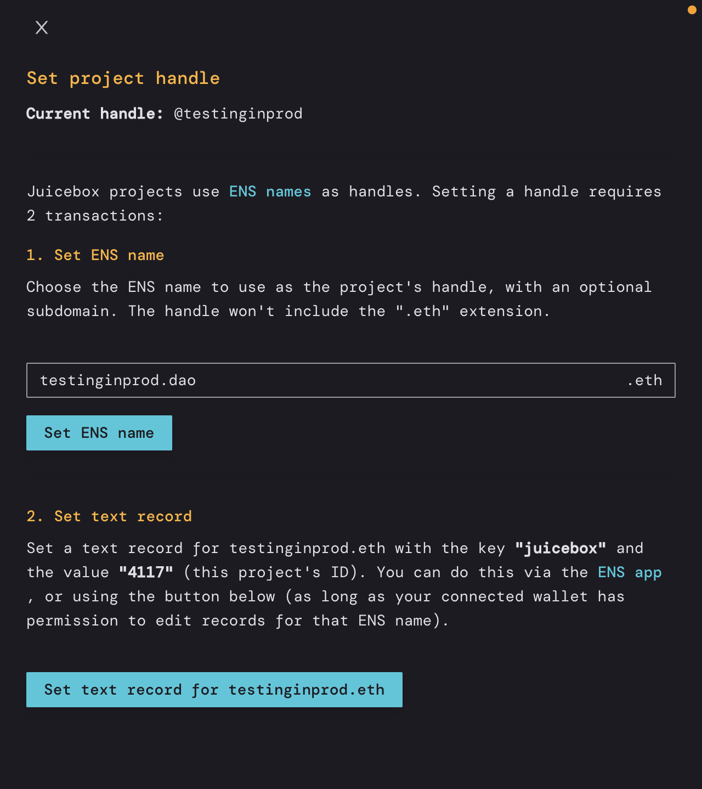
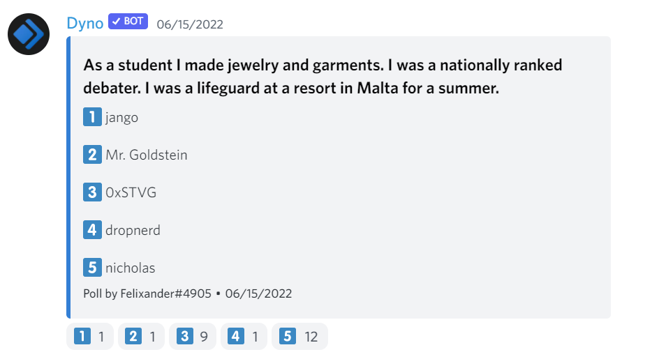

# JuiceboxDAO Town Hall June 14, 2022

## Front end updates with @aeolian and @peri

**@aeolian**: It has been a while since we gave an update, quick couple of housekeeping things on what Peel's up to. So for the last few funding Cycles, we've been operating in two experiments, which has been really great. These align with the Juicebox funding Cycles, I'll drop a [link](https://github.com/orgs/jbx-protocol/projects/1/views/20) in the town hall chat for those who haven't seen it before. So we're basically scheduling issues every two weeks that is aligned with the JuiceboxDAO funding cycle. And I think what we're going to plan to do is to give a recap of the previous funding cycle every two weeks. So next week, we'll give a recap of all the stuff that was done in the last two weeks, which is going to be really really great this time around there's been so much done. So definitely don't want to miss that. 

I want to highlight one quick fun feature. That was merged yesterday. So this is the ability to add Banny stickers to Memos, which is a small thing, but potentially a fun feature which some of you have been enjoying. So thank you for everyone who worked on that particularly JohnnyD who led the implementation. Check [JohnnD's twitter](https://twitter.com/JohnnyD_eth/status/1536600334507843586) for a video demo of this.

There's four big things in flight at the moment. And I'll list them out in order of the time that they'll be shipped more or less. 

1. The first is giving projects the ability to relaunch on V2 and giving token holders the ability to migrate their tokens to the V2 project.
2. Second is V2 project handles, which is being led by Peri. Right now projects on V2 don't have handles like they did in V1 so that is adding support for those. 
3. The third is NFT rewards for projects. Essentially it's giving projects the ability to specify like if you contribute a certain amount of funds to this project, then we will reward you with an NFT. So that's going to be really exciting giving projects another avenue to get funding which is great. 
4. And then the fourth is obviously veBanny and staking.

So I will quicking give an overview of what's in store with V1 V2 migration, basically we need to give V1 projects the ability to relaunch on V2. So the canonical example is juiceboxDAO. We're a V1 projects. We also now have a V2 project but none of our funds are in the V2 project.

What's gonna happen is the projects will re-launch on V2, JuiceboxDAO has already done that so we have a project on V2. They're then gonna move their whole balance to the V2 project. They're going to add another payment terminal to the V2 project, and this is a special payment terminal where it'll accept a V1 token and then return the V2 token in a 1:1 exchange rate.

So basically if I have Juicebox V1 token, there'll be a place in the interface to go to swap my V1 tokens for the new V2 tokens. And that's pretty much it. So the contracts are more or less done. Thank you to jango Dr.Gorilla and whoever else worked on that. That was really quick turnaround. And now it's pretty much up to the front end to get the UI done for all of what I just explained. And then we'll finally have upgrade path to some V1 projects to get on V2 and use all the cool new stuff. 

**@peri**: I think as everybody knows we still aren't supporting project handles for the new V2 projects. And this is basically just has to do with some of the changes that are made in the contracts. We used to store a handle for a project on chain and it requires a lot of extra finessing in the contracts because we had to make sure that people can use the same contract and that handles could be transferred and reserved for certain period of time and claimed, there's a lot of functionalities to bake in. So with the V2 project contracts, we just skipped over all that because it ended up not being very necessary for the functionality of the contracts themselves. But the downside of course is that it's really nice to have in the app to be able to look up projects and search for projects.

So we've been working on another layer, another contract to add into the existing contracts that will support handles for V2 projects. It is not quite finished and it's not on mainnet yet.  But we do have everything kind of functionally together so I can give a demo of how it'll work in the app and explain how it works pretty quickly.

_(screen sharing ongoing)_

So I've got this empty project here on Rinkeby, ID 4117.  And we are going to set a handle for this project. 

We've got a two-transaction-process for setting a project handle. And so the way that this works is we decided to use ENS names to handle the uniqueness of project handles what I mentioned earlier for making sure that handles be passed around and exchanged. There's a lot of complexity there that ENS has already solved really beautifully and so we built the system around ENS names. The idea here is that if you want to use a handle for a project you will need to own the matching ENS name. So for example, I just got this ENS name on rinkby testinginprod.eth and this would allow me to set the handle of this project to testinginprod. So I'm gonna do two steps here,

1. I have to own this ENS name first of course,  I'm going to set the ENS name testinginprod.eth and this would be one transaction. Once this completes, step one will be done.
2. The next step here is to actually set a text record on the ENS name. So if anybody's used the ENS name app before you'll know that you can come down and set these text records for any number of different things. We are using a particular key "Juicebox project ID". You can come and set this property in the ENS name app manually if you want, but that's a little bit of extra work. So we've made it nice, pretty and clean in the app and you can basically come down here and click this button and we're gonna set that value in the ENS name text record to the ID of this project. So this one is 4117. So I'm going to send this transaction, which is the same as if I just came over here and just manually put 4117 here. That'll show up here if you got the handle set up.

Most importantly that'll allow your project to be searched on the projects page. Right now the search bar works by searching for project handles and V2 projects don't have handles you can't search for them. It's very lame that is now a thing of the past as soon as you set a handle for your project. Your project will be searchable. 

An important thing to note is that either of these things change, for example if you were to transfer the ENS name and someone else changes that text record, your handle will go back to empty. So you have to have both of these things set constantly or if you were to change this to some other ENS name, your handle would go back to empty.

Another fun fact is you can also actually do subdomains here. 

We will hopefully have that on mainnet this week. I'm pretty sure we're doing. some just some last-minute things, but mostly everything is good to go. So expect it pretty soon. 

**@0xSTVG:** So does that mean that I could create multiple projects with subdomains of my ENS?

**@peri**: You could. But you can't have multiple projects using the same ENS name. So if you had like STVG.eth, and you want to do like one project one.STVG.eth and the other project two.STVG.eth, those could be two separate handles for different projects.

@mieos: Once we get that up and running, I think a screen recording of you going through that or WAGMI can put together a little infographic on what it is and how it works, especially when it gets up to the subdomain part, it's just technical enough. 

## veBanny by @Jmill

I want to show a map with the veBanny stuff. I've been doing some work on the subgraph implementation to index the user tokens and interact with them. Right now we had a couple of big steps forward. One thing is there's now a metadata file to parse for all the the characters or the variants so you can go through and scroll through the characters and figure out which one you want and then you can see them all in here, too. So that's been a nice upgrade because you can pull that all from one place now.

_(screen sharing ongoing)_

So these are NFT positions that I've taken on this account. So you like lock positions that are actually coming from on chain. And then you can interact with them also, so I can do that to extend the lock or I can unlock the ones that have finished. So I can take this one and extend the lock like a thousand days. Then it takes a minute for the graph to re-index it, but it'll show up 30 seconds later with the new lockdate.

And then other than that I showed this last week, we have a new contract where you can mint for one second just like test the unlock and redeem stuff. But yeah, I showed this on the last demo where you can  also like take a staking position and actually mint these things through the front end works also. 

## quizz time:

The answer is....

**Nicholas**

- As a student I made jewelry and garment. 
- I was a nationally ranked debater.
- I haven't been Malta before.

## NFT update by @JohnnyD

**@JohnnyD**: I'll just add a few sentences to what @aeolian has summarized before. We're gonna be automatically rewarding contributors NFTs when they contribute above a certain amount. and then the next step will be adding a restriction around, such as time restrictions so ensuring that those NFTs are distributed only before a certain funding cycle. But for now, we're just going with the amounts. 

## Announcement from @briley

**@briley**: Yeah, thanks. I was just gonna make a small announcement that Matthew and I are recording podcast episode with lexicon Devils on Thursday if you have any questions that you would like to ask you can let us know. Otherwise, we'll be doing that in advance of the JB MorganStern's voxel slash IRL event.

