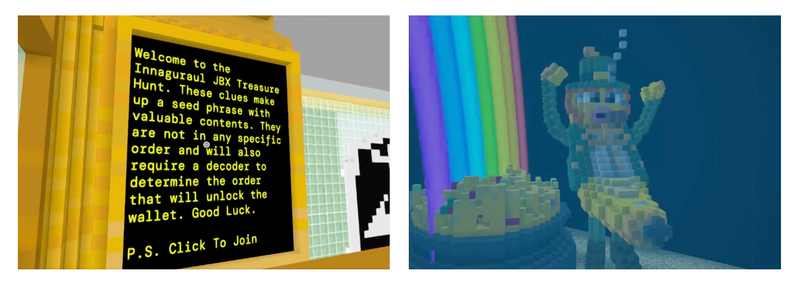
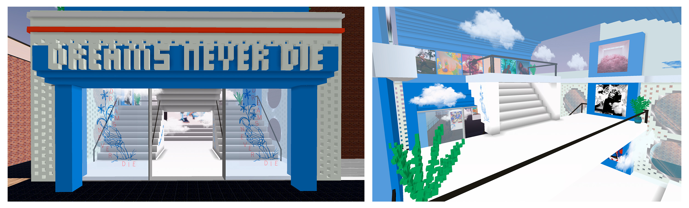
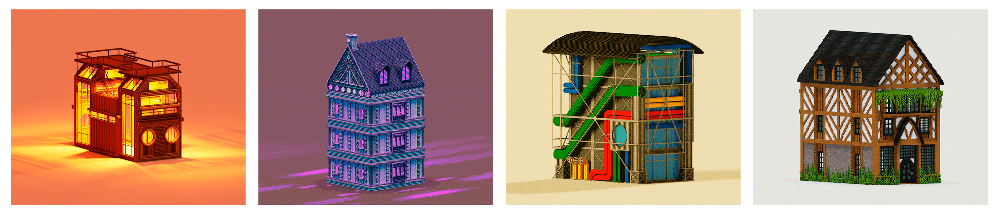
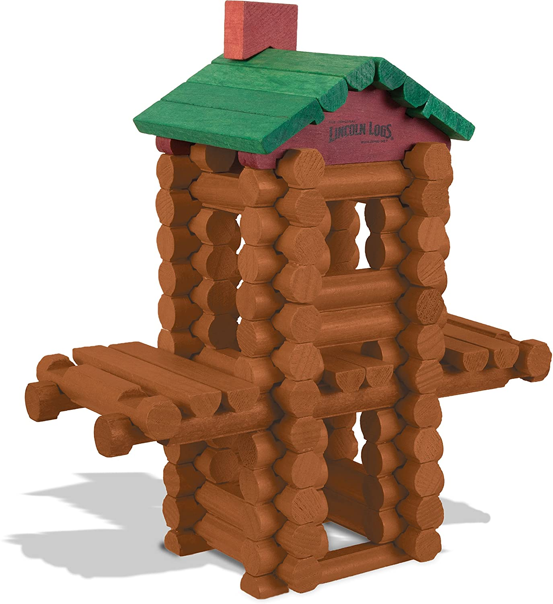

# Lexicon Devils: A Metaverse Architecture Guild Running on Juicebox  

***How Lexicon Devils is building the metaverse, getting paid to do it, and managing their treasury on Juicebox.***  

### Metaverse architecture and video games  

I spent the majority of my childhood exploring the internet and playing classic computer games like *Age of the Empires*, *The Secret of Monkey Island*, and especially *The Sims*. For hours and hours I would build, design, and arrange anything I could think up. Unbound by the limits of gravity, money, or even common sense, *The Sims* was an excuse to imagine what was possible rather than what was realistic. At the time this maybe seemed like a silly diversion, but like many of our early internet activities this turned out to be great practice for the future that was hurdling towards us. Spending hours customizing a Myspace page was, in retrospect, a great introduction to frontend development. And perhaps The Sims was the perfect introduction to metaverse architecture.

image: *Old Town* in The Sims (2000)  

### Lexicon Devils origin story  

[Lexicon Devils](https://juicebox.money/#/p/lexicondevils), named after an EP by LA punk rock band Germs, is a guild of metaverse builders architecting virtual experiences in Voxels, Substrata, and beyond. They acquire parcels, design and execute complex builds, and organize interactive events including DJ sets, treasure hunts, parades, art exhibitions, and performances.

Around the time that Shark DAO was making waves, [Peacenode](https://twitter.com/peace_node) got a call from [Stav](https://twitter.com/I_AM_STAV) and started chatting with [Nicholas](https://twitter.com/nnnnicholas/) and [Dropnerd](https://twitter.com/dropnerdETH) about this “beautiful infrastructure layer of the internet that we’re all building on Ethereum.” One thing led to another and [Peacenode](https://twitter.com/peace_node) was soon talking with [Mieos](https://twitter.com/Mieos_ETH) from [WAGMI Studios](https://juicebox.money/#/p/wagmistudios) about a cross-DAO collaboration to create a Juicebox metaverse experience and the rest is history.

> I’ll never forget meeting Wacko, he was rocking the most insane wearables every 30 seconds. We just had to ask if he could join us and put him on the payroll.
>
> — Peacenode

Rather than sending funds p2p, Peacenode explained that the [Lexicon Devils project on Juicebox](https://juicebox.money/#/p/lexicondevils) would issue payouts to a team of contributors on a set schedule. In other words: “I know you don’t know us, but let’s hang out.” Building in the open with a trustless, transparent treasury means easily building friendships and communities regardless of identity or credentials. Find your community, bring the good vibes.

And who knows, you might even end up making an ultra tropical banana-themed learning center complete with an animated gondolier.

image: The first iteration of the Juicebar and Juicebox Learning Center

### A home for Banny: iterations of the Juicebox parcel in Voxels  

v1 of the Juicebar was built as a home for Banny, the iconic blunt-smoking banana mascot of Juicebox. It was also home to the Juicebox Learning Center, a juicy and playful institution where visitors could watch videos about the protocol, learn terms in the glossary, and participate in ongoing JB events. This tropical parcel quickly became an oasis for long-time Banny devotees and newcomers alike to learn more about the crypto crowdfunding protocol that enables anyone to fund the “thing” of their dreams on Ethereum.

As part of the growing bannyverse, [WAGMI Studios](https://juicebox.money/#/p/wagmistudios) and [Lexicon Devils](https://juicebox.money/#/p/lexicondevils) organized the first ever JB metaverse treasure hunt with clues that make up a seed phrase… *but only with the help of a decoder*. Prizes included 200,000 $JBX and a treasure chest filled with dope NFTs.

image: The Bannyverse Treasure Hunt

Since October 2021, the Juicebox plot in Voxels has gone through many iterations as a center for learning, discovery, and entertainment. It stands out from surrounding parcels with its attention to detail and references to IRL architecture and design. Through pixelated curves and large windows blending the inside and outside, the current [Juicebox v2 build](http://juicebox.lexicondevils.xyz/) combines characteristics of mid-century modern design with a tropical Banny aesthetic. Bringing this all together in one big juicy cocktail, the v2 build is a utopian dream in line with the ethos that anyone can grow and fund their dream project.  

image: v2 of the Juicebox Learning Center, Transit Center, and Juicebar

### Lexicon Devils' wild and imaginative custom builds  

In addition to building for Juicebox, [Lexicon Devils](https://juicebox.money/#/p/lexicondevils) have designed and built a custom HQ for [Dreams Never Die](https://www.cryptovoxels.com/play?coords=5968W,1708N), a web3 music DAO, and a browser-based metaverse experience for NFT project [Slothtopia](https://slothtopia.io/). [Wackozacco](http://twitter.com/wackozacco420) was also commissioned to design a number of custom builds on [Architect Island](https://www.cryptovoxels.com/islands/architect-island) which draw inspiration from Neo-Andean, Oriental, Tudor, and Structural Expressionism movements.

  

image: Dreams Never Die HQ at [31 Bran Ave](https://www.cryptovoxels.com/play?coords=5968W,1708N)  

  

image: Custom builds by [Wackozacco](http://twitter.com/wackozacco420) on Architect Island  
left to right: [3 Schism Street](https://www.voxels.com/parcels/7968/visit), [7 Marayaco Ave](https://www.voxels.com/play?coords=N@1081E,1086N,0.5U), [2 Schism Street](https://www.voxels.com/parcels/7963/visit), [29 Marble Road](https://www.voxels.com/play?coords=W@1084E,1137N)  

> *I never would have imagined [becoming a metaverse architect]. I was designing video game skins when I was younger, not really thinking about it. As I was growing up, I felt like I needed to do something more meaningful and then I found out that you could paid for doing stuff like this. It was a re-discovery of a passion and realizing that it can produce value.*
>
> — Wackozacco

Whether referencing the physical world or playing with what defies reality, Voxels and other metaverses allow for architects to focus on design and function rather than costs, materials, or bureaucratic mazes like zoning laws. Anyone is able to learn to build in the metaverse, regardless of their education or previous knowledge of architecture. Coming from a wide range of backgrounds, the team at [Lexicon Devils](https://juicebox.money/#/p/lexicondevils) has spent the last year creating metaverse experiences and custom builds for other orgs, all while managing their treasury on Juicebox.

> *If you had asked me in January 2020, I couldn’t have anticipated where I am today with my friends. It’s pretty amazing. Actually, when I was a kid, there was a stint where I wanted to be an architect. I was a Lincoln Log kid, so maybe it makes sense.*
>
> — Peacenode

  

image: [Lincoln Logs](https://en.wikipedia.org/wiki/Lincoln_Logs), a popular children’s toy invented in 1916 by John Lloyd Wright, son of well-known architect [Frank Lloyd Wright](https://en.wikipedia.org/wiki/Frank_Lloyd_Wright).  

### FORMING and coming full circle with Juicebox  

As the pinnacle of their monthly Juicebox event series Lexicon Devils is hosting [FORMING](http://forming.lexicondevils.xyz/), an experimental hyperverse concert with a curated lineup of performances by web3 musicians. Lexicon Devils has created and funded [a new Juicebox project](https://juicebox.money/#/v2/p/66) through which all participating artists will be paid in ETH. By paying musicians through the project, artists also get a chance to learn first-hand about the Juicebox protocol and how it works.  

> “That’s the synthesis of our experience of learning about Juicebox. It’s not just an event at JB, but an event that gets people to learn about JB through our events”.  
> — Wackozacco  

### Relevant links  

Listen to Peacenode and Wackozacco tell the story of Lexicon Devils on [episode 8 of The Juicecast](https://anchor.fm/thejuicecast/episodes/Ep--8-Peacenode-and-Wackozacco-from-Lexicon-Devils-e1l3k94)

Visit the [Juicebox parcel in Voxels](http://juicebox.lexicondevils.xyz/)

Visit the [Lexicon Devils HQ in Voxels](https://www.cryptovoxels.com/play?coords=SW@6703W,48N)

Follow Juicebox on Twitter: [@JuiceboxETH](https://twitter.com/juiceboxETH)

Follow Lexicon Devils on Twitter: [@Devils_Lexicon](https://twitter.com/devils_lexicon)

Set up a Juicebox project on [Juicebox.money](https://juicebox.money/#/)  
