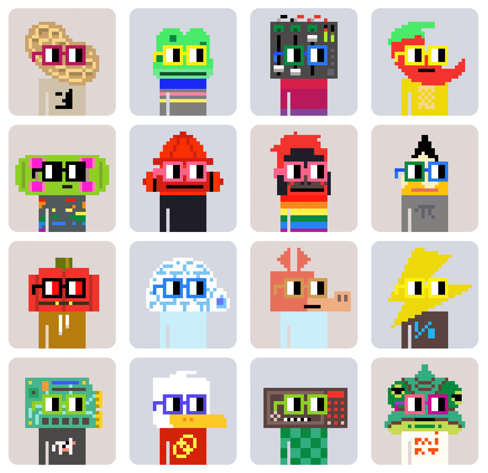
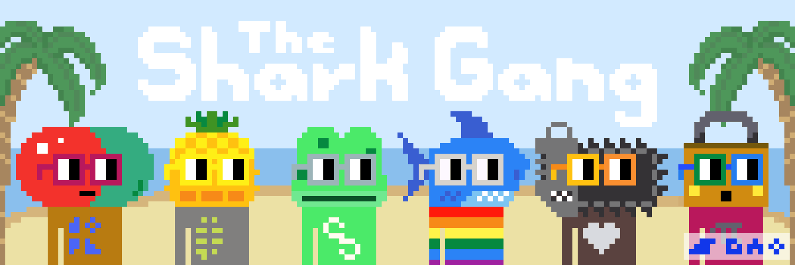
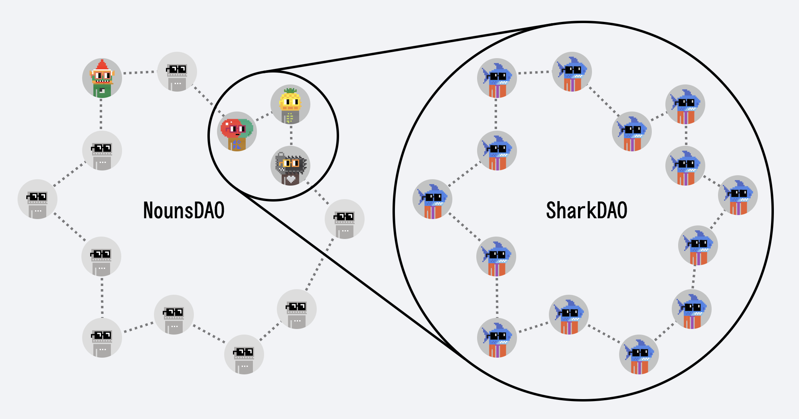
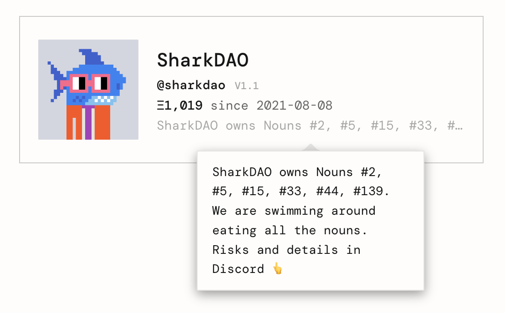
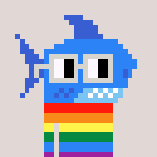
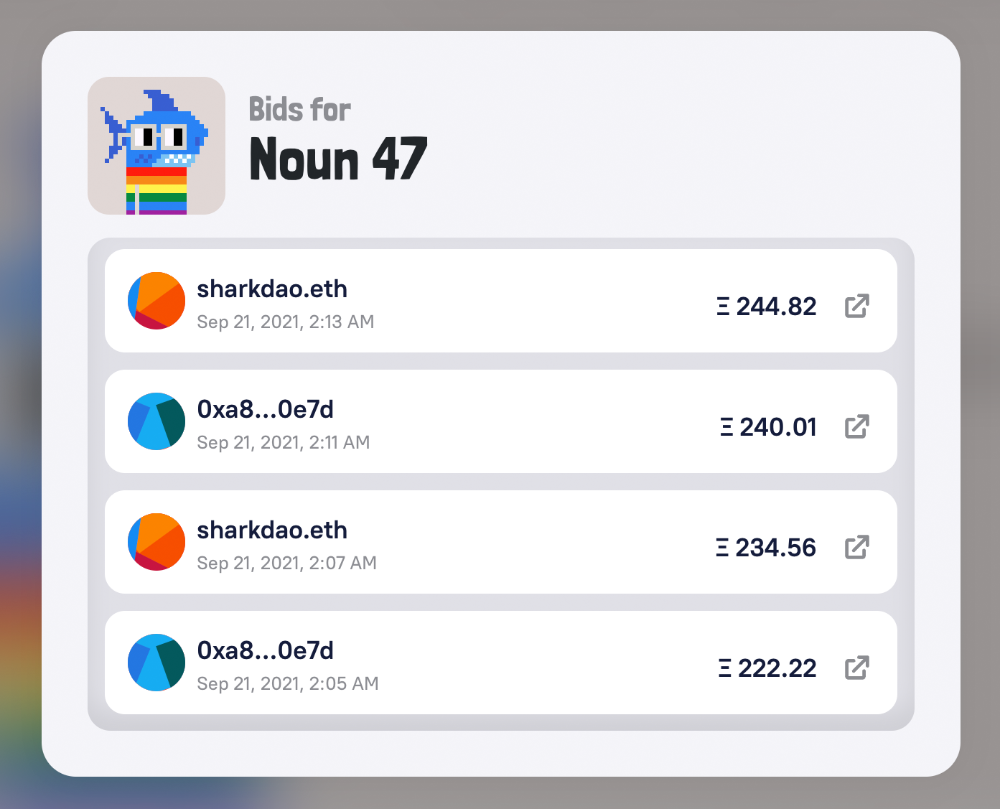
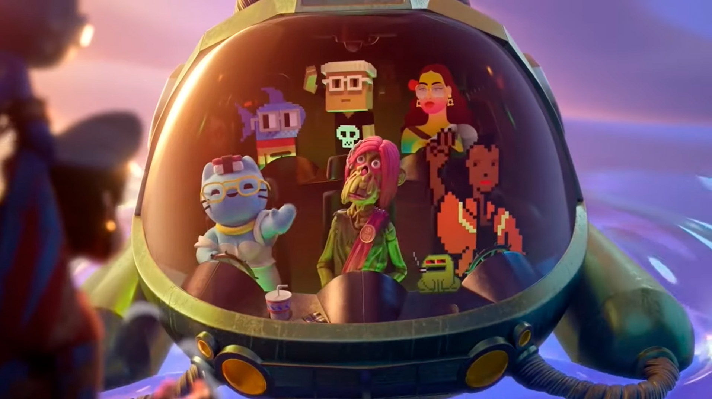

# SharkDAO: A sub-DAO raising funds to participate in the Nouns Ecosystem  

## One Noun, every day, forever.  

  
image: A series of Nouns generated in the Playground at [nouns.wtf/playground](https://nouns.wtf/playground)  

### WTF are Nouns?  

Nouns is an on-chain generative NFT project and experiment in community building through avatars. Nouns are 32x32 pixel characters with heads that represent a noun like “igloo,” “skateboard,” or “peanut.” One Noun is auctioned every twenty-four hours, forever, with all proceeds going to the Nouns treasury. When one auction is settled, the next Noun is generated and a new auction begins. Each Noun is entitled to one vote in Nouns DAO governance which decides how the treasury should be used.  

Auction bids for Nouns can easily reach over 100 ETH. As a result, owning a Noun is often limited to those that can afford to win these competitive auctions… unless you’re a member of SharkDAO ⌐◨-◨  

### SharkDAO, a shiver of Nouns enthusiasts  

Did you know that a group of sharks is called a shiver? SharkDAO brings together Nouns enthusiasts with the shared goal of acquiring Nouns and contributing to the Nouns ecosystem. Together they pool funds, participate in Nouns DAO governance, and partner with artists, developers, and DAOs to create Nounish experiences. This has taken the form of [podcasts](https://podcasts.apple.com/us/podcast/meet-the-sharks/id1605492563), [NFT collaborations](https://opensea.io/assets/ethereum/0x495f947276749ce646f68ac8c248420045cb7b5e/95967798888951567848103900867485523214406787411953560656221044242283845648484), and Nouns DAO proposals like [e-sports initiatives](https://nouns.wtf/vote/68) and [CC0 Story Bibles](https://nouns.wtf/vote/70).  

They currently hold six Nouns: 2, 5, 15, 33, 47, and 139 which have been named by the Shark community as follows:  

🍍 Noun 2: Piña, named after its pineapple head  

🪚 Noun 5: Bruce, a reference to actor Bruce Campbell who wields a chainsaw in the movie [The Evil Dead](https://en.wikipedia.org/wiki/The_Evil_Dead)  

💊 Noun 15: Morpheus, based on Laurence Fishburne’s character from [The Matrix](https://en.wikipedia.org/wiki/The_Matrix_(franchise))  

🐸 Noun 33: Froger, named after its frog head  

🦈 Noun 47: Swimshady, the cool alter ego of the Shark Noun  

🔒 Noun 139: Paddy, named after its padlock-shaped head  

  
Left to right: Nouns 15, 2, 33, 47, 5 and 139  

### Building the plane while you fly it  

As an experiment in on-chain avatar communities, Nouns DAO’s mission is to spread the Nounish word with the help of Nouns holders who make up the voting body of the DAO.

> While projects such as CryptoPunks have attempted to bootstrap digital community and identity, Nouns attempt to bootstrap identity, community, governance, and a treasury that can be used by the community for the creation of long-term value.
>

— [Punk 4156](https://twitter.com/punk4156)

Holding only 6/300+ votes might not seem like much, but lurking beneath the waters SharkDAO is active in discussions, pushing ideas through the ecosystem, and able to get a lot more done than what their voting power implies. Since Nouns has no roadmap from the Nounders (founders), Nouns is community-owned which gives power to holders to propose initiatives and decide how to use treasury funds. In other words, the task of building community and shaping the future of Nouns belongs to community members who hold Nouns, rather than the founders. SharkDAO, as one of only a handful of sub-DAOs within Nouns DAO, is one of the groups building this roadmap on-the-fly.

> “In short, sub-DAOs participation in a DAO is shaping and contributing a voice to that community so that the best ideas get surfaced, voted on, and make an impact in the world.”
>

— [Dropnerd](https://twitter.com/dropnerdETH)

  
image: SharkDAO and NounsDAO visualization from [sharks.wtf](http://sharks.wtf)  

### SharkDAO, the meme that jumped from Rinkeby to mainnet  

It all started with a small group of frens helping Nouns DAO test out their auction mechanism before it went live. [Goldy](https://twitter.com/Goldypix), [4156](https://twitter.com/punk4156), [Dropnerd](https://twitter.com/dropnerdETH), [Lithium](https://twitter.com/LithiumXBT), [Kenbot](https://twitter.com/kenbot), [Del Piero](https://twitter.com/iamDelPiero) and [Defi Jesus](https://twitter.com/eldefijesus) were a few of these early swimmers. The Shark Noun was one of the first Nouns that was acquired on testnet by the group and they decided to build around that Shark identity. They launched a [Discord](http://discord.gg/QNbuygdK3A), started bringing in contributors, and began planning how they were going to crowdfund to buy Nouns.

  
image: [4156](https://twitter.com/punk4156) announcing that the Rinkeby shark was acquired  

> SharkDAO is a meme that jumped from Rinkeby to mainnet.”  
>  

— [Kenbot](https://twitter.com/kenbot) in a [Twitter Space](https://twitter.com/i/spaces/1BRKjnZpLdjKw?s=20) hosted by [nnnnicholas](https://twitter.com/nnnnicholas)  

When it came to figuring out how to fundraise in order to bid on the first Noun, [Kenny](https://twitter.com/kenbot) dives into the Discord and suggests a cool project he heard of called Juicebox. Building a treasury on Juicebox would allow the group to trustlessly raise funds and manage their treasury, without the risks of YOLO’ing ETH into a multi-sig.  

  
image: SharkDAO [project page](https://juicebox.money/#/p/sharkdao) on Juicebox  

From there, SharkDAO set up a Juicebox project on Rinkeby. Dropnerd was doing the testing and was still new to signing transactions. “I was very excited to see everything come together so easily without needing to interact with a bunch of smart contracts directly,” he explained. “The UI showed me exactly what was going on which made it a lot easier for the DAO. Looking back I can’t think of another platform where we could have raised 200+ ETH in the first few days without the help of Juicebox.  

### SharkDAO catching the Shark Noun  

  
image: Noun 47, the Shark Noun  

Although new Nouns may seem random and impossible to predict, their traits are actually determined by the previous blockhash. And if you’re particularly clever, you can use the crystal ball to predict and even choose the next Noun that will be generated 🔮  

Before the Shark Noun was generated, founding member [Goldy](https://twitter.com/Goldypix) was eyeing the [Noun Crystal Ball](https://nouns-crystal-ball.netlify.app/) every day for weeks. This magical tool shows you what the next Noun will look like if the auction is settled on the current block by calling the `settleCurentAndCreateNewAuction()` function on the `NounsAuctionHouse` contract.  

Usually the winning bidder will settle the auction, but anyone can call `settleCurentAndCreateNewAuction()` at a particular block and help decide what the next Noun will look like. In a glimpse of a moment, Goldy saw the Shark Noun in the Crystal Ball and [submitted the transaction](0xba8560127d046bb5b2c92cae027a8741f3301975ef37752e23e3b3b1e565cd07) before the next block to secure it.    

  
image: The Noun Crystal Ball 🔮  

SharkDAO had to act fast if they wanted the Shark Noun. The DAO established an auction committee, re-opened their Juicebox project, and expanded their multi-sig to include 5 members. Within the first few days of re-opening for contributions, they received over Ξ150 from community members.  

### Where there’s a will, there’s a wave 🌊  

The team suspected that someone was watching within the DAO and took their calls offline to discuss the details of their strategy in real time, including their final bid number. It wasn’t an easy auction to win though: the Shark Noun was desired by many and led to a *jawesome* bidding war. Over the next 24 hours the bidding quickly went past Ξ100 and then Ξ200 soon after. It became clear that the price of Noun 47 was going to swim past most Nouns auctions, apart from the very first Noun that sold for Ξ600. After their penultimate bid of Ξ244.82, SharkDAO was getting pretty close to exhausting the amount that they set aside for the auction. Though winning Noun #47 was non-negotiable, they also needed to conserve enough treasury funds to ensure that the DAO could continue to build into the future.

  
image: Timeline of some of the final bids on the auction for Noun 47.

If a bid is placed in the last five minutes of an auction, the timer is extended by another five minutes. Due to the cumbersome nature of bidding via a Gnosis Safe, the DAO came pretty close to losing the shark. There was even one bid where the last signer was executing the transaction with only 45 seconds left on the clock.

After a [last minute bid](https://etherscan.io/tx/0x84366348b21453396194567271bf0f575a17bf48f4e66e0b4c0f29d54e119fbc) of Ξ258.88 by 0xa8...0e7d, the team had minutes to coordinate and agree on the next bid price before multisig signers could approve the transaction. And on September 21, 2021 at 2:19am, SharkDAO [won the final bid for 269.69 ETH](https://etherscan.io/tx/0x1f60d7ddc1cf1e627984bfc431c62dc4f7f28ab2b377b9ad2db0d21327e627e0).  

  
image: Noun 47, the Shark Noun  

### SharkDAO celebrates their shark-versary  

Since their launch on August 8th, 2021, [SharkDAO](https://juicebox.money/#/p/sharkdao) has raised over 1000 ETH on Juicebox, acquired six Nouns, and brought together over 800 sharks. As a sub-DAO, they’ve pushed several proposals over the *fin-ish* line in the Nouniverse including [Nouns-based short films](https://nouns.wtf/vote/20) and [FOMO Nouns](https://nouns.wtf/vote/8). SharkDAO has also [helped provide eye exams and glasses to thousands of kids in need](https://nouns.wtf/vote/104), donated 5 ETH to the [Coral Restoration Foundation](https://www.coralrestoration.org/crypto-donations/), and started a new [Juicebox project](https://juicebox.money/#/p/sharkfrens) to raise 60+ ETH for founding member [Del Piero](https://twitter.com/iamDelPiero)’s son’s leukemia treatment.  

The Shark Noun has become an icon and remains one of the most recognizable Nouns. In a particularly surreal turn of events, Noun #47 aka Swim Shady was featured in Yuga Labs’ [Otherside promo video](https://twitter.com/yugalabs/status/1505014986556551172?ref_src=twsrc%5Etfw%7Ctwcamp%5Etweetembed%7Ctwterm%5E1505014986556551172%7Ctwgr%5E%7Ctwcon%5Es1_&ref_url=https%3A%2F%2Fwww.todayscrypto.news%2Fotherside-yuga-labs-metaverse-lands-in-april%2F) alongside Cryptopunks, Cool Cats, CrypToadz, World of Women, and Meebits. Not only were Nouns included as one of a handful of projects to represent NFTs a whole, but the Shark Noun was chosen as its iconic ambassador.  

What’s next for SharkDAO? Stay tuned for future NounsDAO proposals like the [Monthly Nouns Comics project](https://discourse.nouns.wtf/t/monthly-nouns-comics-for-mass-market-release-v2/1717) currently being developed by DefaultedUser and [ComicsDAO](https://www.juicebox.money/v2/p/31) in collaboration with SharkDAO. The [Shark Island pfp project](https://sharks.wtf/art) is also currently in the works as well as the DAO’s [growing collection of Shark-themed art](https://opensea.io/0xae7f458667f1b30746354abc3157907d9f6fd15e).  

  
image: Shark Noun featured in Yuga Labs’ Otherside promo video  

> The value of SHARK is derived not only from its ETH stored in the Juicebox contracts, but also from the NFTs the DAO has deployed treasury funds to acquire, from the JBX that the DAO has begun accumulating by paying platform fees, and perhaps most importantly from the productive community forming within the project that gives it boundless potential moving forward.
>  

– [Jango](https://twitter.com/me_jango), from [Juicebox V2: Protocol adjustments useful for adding treasury tokens to AMMs](https://info.juicebox.money/blog/adding-juicebox-treasury-tokens-to-amms)  

### Relevant links  

Listen to Dropnerd tell the story of SharkDAO on [episode 5 of The Juicecast](https://anchor.fm/thejuicecast/episodes/Ep--5---Dropnerd-from-SharkDAO-e1i7i5q)  

Follow Juicebox on Twitter: [@JuiceboxETH](https://twitter.com/juiceboxETH)  

Follow SharkDAO on Twitter: [@sharkdao](https://twitter.com/sharkdao)  

Join SharkDAO’s Discord: [discord.gg/QNbuygdK3A](http://discord.gg/QNbuygdK3A)  

Set up a Juicebox project on [Juicebox.money](https://juicebox.money/#/)
