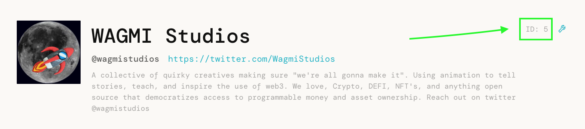

# How to Send ETH Directly to JB Project

1. Deploy a contract to forward funds into your project
2. You can do that by calling "deployAddress" on the TerminalDirectory:
[https://etherscan.io/address/0x46C9999A2EDCD5aA177ed7E8af90c68b7d75Ba46#writeContract](https://etherscan.io/address/0x46C9999A2EDCD5aA177ed7E8af90c68b7d75Ba46#writeContract)
3. send the project's projectId, and the memo that should be forwarded along with payments to the address:

1. once deployed, you can see the address by calling "addressesOf":

.png)
